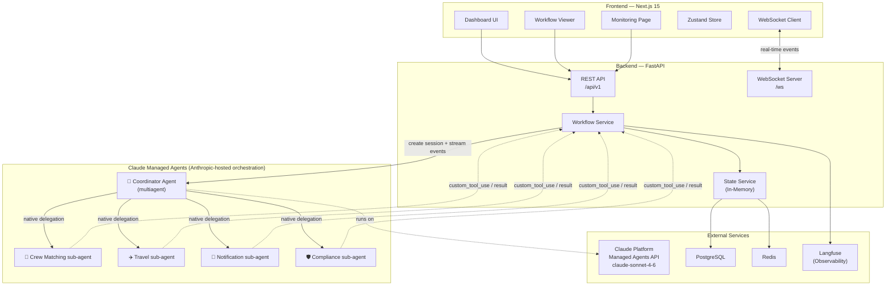
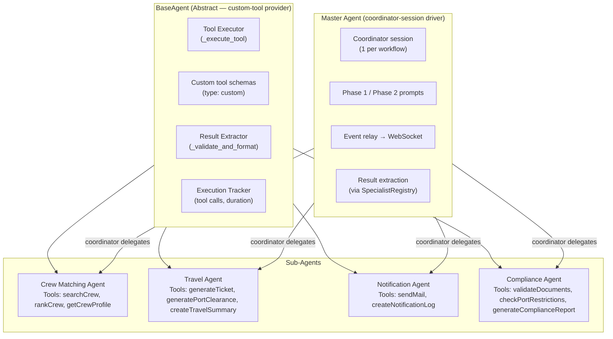
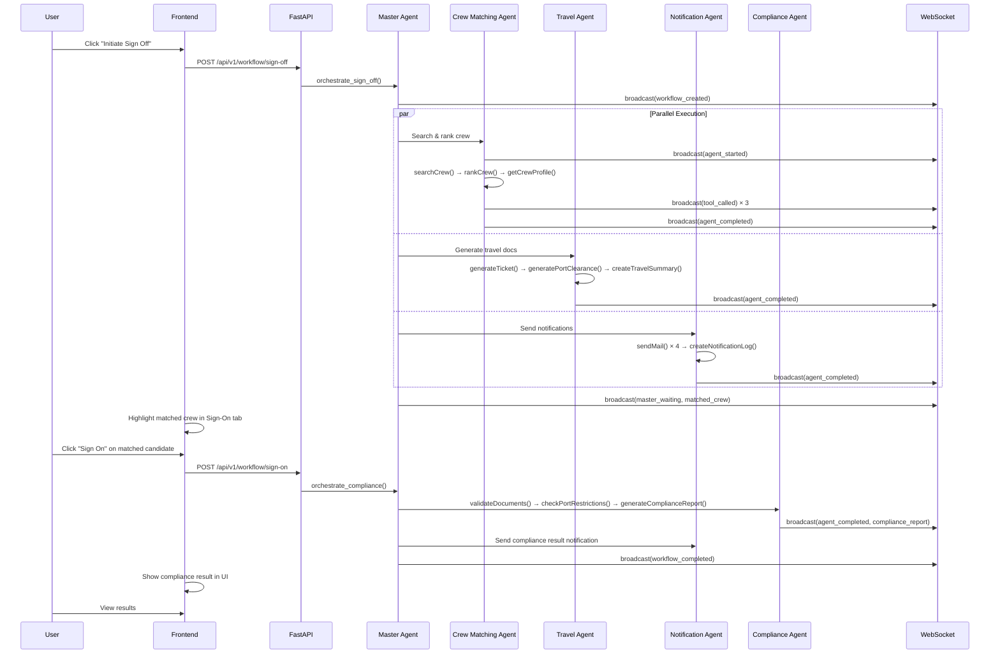
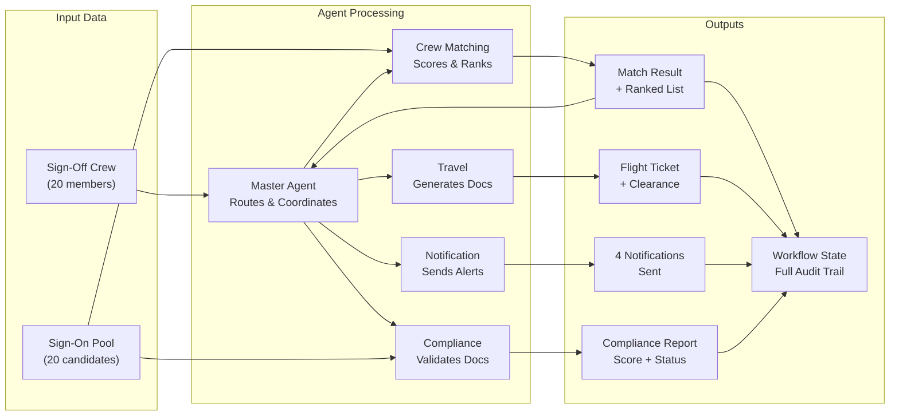
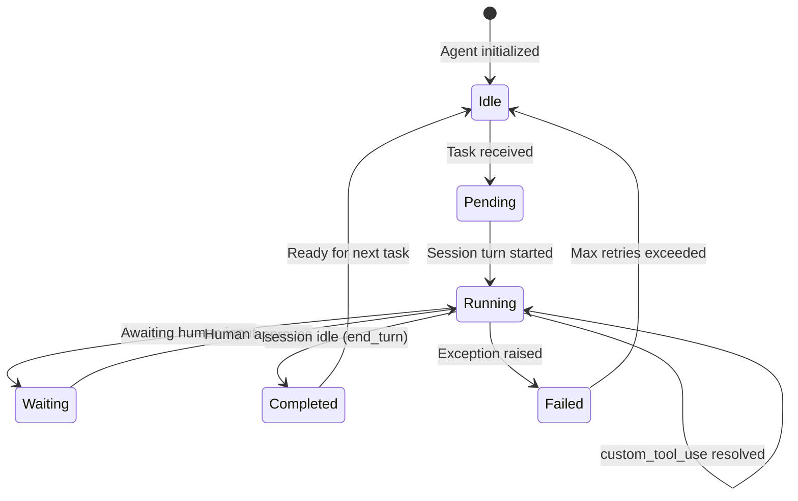
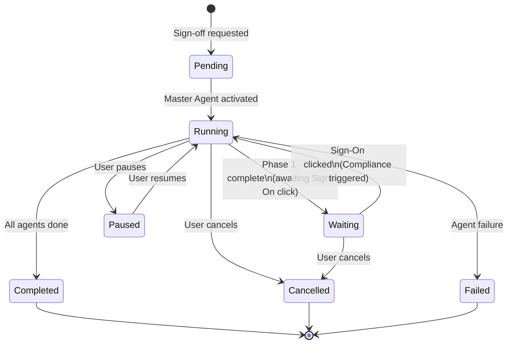

# Architecture Diagrams — Maritime Crew Orchestrator

## 0. Managed Agents Topology (how the AI actually runs)

This system uses the **Claude Managed Agents** product (`client.beta.agents` /
`sessions` / `environments`, beta `managed-agents-2026-04-01`). The agent loop runs
on **Anthropic's orchestration layer**, not in this process:

- **5 persisted agents**, created once by `scripts/setup_managed_agents.py` and visible
  in the Console: a **coordinator** (`multiagent: {type: "coordinator", agents: [...]}`)
  plus four **specialist** agents (crew_matching, travel, notification, compliance).
- **One coordinator session per workflow.** The backend opens a session on the
  coordinator and sends one user message per phase. The coordinator **natively
  delegates** to the specialist sub-agents (each runs in its own thread).
- **Tools are custom (client-side).** Each specialist's tools (`searchCrew`,
  `validateDocuments`, …) are declared as `type: "custom"`. When a sub-agent calls
  one, an `agent.custom_tool_use` event arrives on our session stream; the FastAPI
  backend executes the Python implementation (over mock data) and replies with
  `user.custom_tool_result`. **No tool secrets or data enter the Anthropic container.**
- **The session is stateful across the human-in-the-loop pause.** Phase 1 (sign-off)
  runs crew/travel/notification, then the session goes idle. When the user clicks
  "Sign On", Phase 2 (compliance) is sent to the *same* session, which retains context.

Code map: `agents/managed/registry.py` (agent configs + tool routing),
`agents/managed/client.py` (session driver), `agents/master_agent.py` (per-workflow
orchestration), `agents/*_agent.py` (specialist tool logic, reused as custom tools).

## 1. System Architecture

## 2. Agent Architecture

## 3. Workflow Sequence Diagram

## 4. Data Flow Diagram

## 5. Agent Lifecycle Diagram

## 6. State Machine — Workflow

