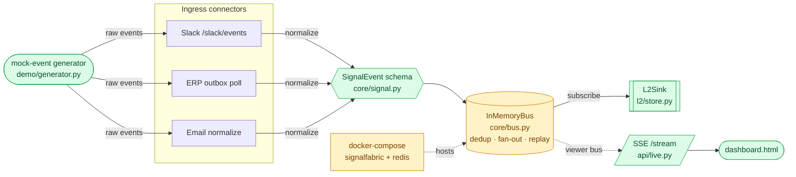
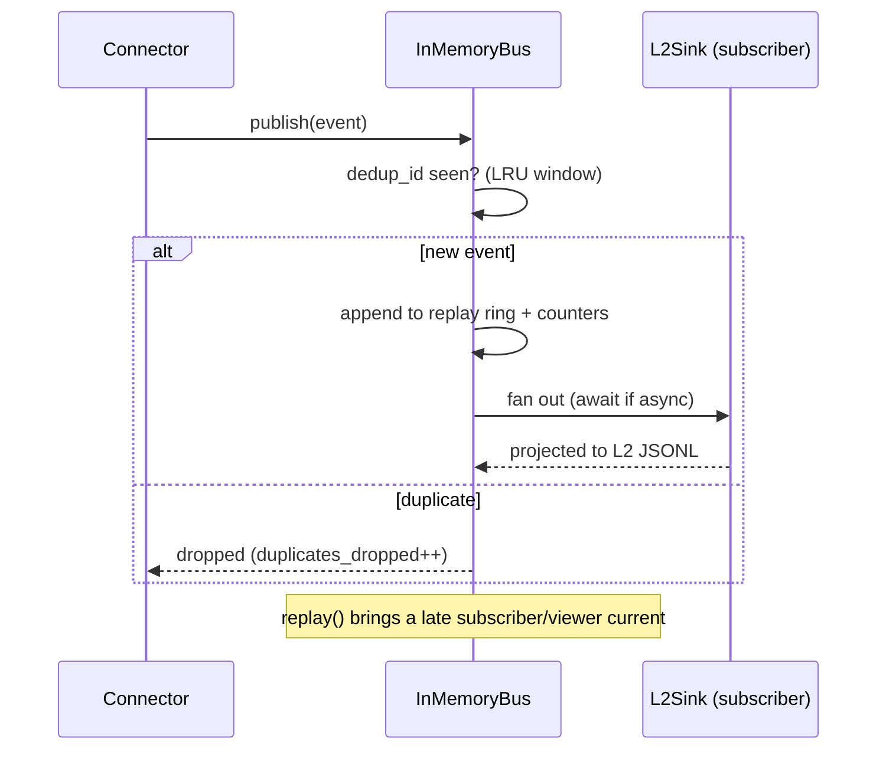
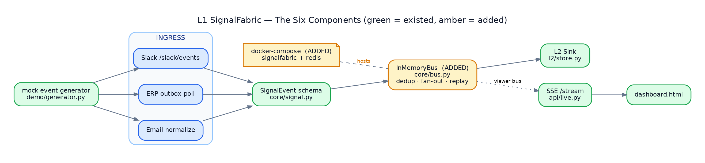

# The Six Components — status & visualization

This maps the six requested building blocks onto L1 SignalFabric, **compared
against the Freight-invoice SignalFabric reference**, and shows which already
existed in this scaffold versus what was integrated.

| # | Component | Where it lives | Status | Freight-invoice analogue |
|---|-----------|----------------|--------|--------------------------|
| 1 | **SignalEvent schema** | [`core/signal.py`](../core/signal.py) | ✅ existed | `models.Signal` |
| 2 | **InMemoryBus** | [`core/bus.py`](../core/bus.py) | 🟢 **added** | `demo.simulator.Broker` + dispatcher dedup |
| 3 | **L2Sink stub** | [`l2/store.py`](../l2/store.py) | ✅ existed | `dispatcher.logging_subscriber` → `L2Projector` |
| 4 | **SSE `/stream`** | [`api/live.py`](../api/live.py) | ✅ existed | `demo/dashboard.py` `/events` |
| 5 | **mock-event generator** | [`demo/generator.py`](../demo/generator.py) | ✅ existed | `demo/generator.py` + `simulator.py` |
| 6 | **docker-compose** | [`../docker-compose.yml`](../docker-compose.yml) | 🟢 **added** | *(none — deferred there)* |

> 🟢 = built in this change. Before this, `core/bus.py` shipped only the
> `EventBus` Protocol + a `LoggingEventBus` placeholder (the README listed the
> "real InMemoryBus" as deferred to the core track), and there was no
> `docker-compose`. The other four were already present and working.

## Pipeline (the six in context)



## InMemoryBus behaviour (what "integrate" added)



## Drop-in seam

The bus implements the existing `EventBus` Protocol, so it integrates with **no
change to any connector or route**:

```python
from core.bus import InMemoryBus
from api.app import create_app

bus = InMemoryBus()          # dedup + fan-out + replay
app = create_app(bus=bus)    # create_app subscribes the L2 sink to it
```

The Day-4 `RedisStreamsBus` will implement the same Protocol + `subscribe`/
`replay` surface — swap-in by construction. `docker-compose.yml` already ships
the `redis` service as that seam.

## Live visualization

The running service visualizes the whole pipe in the browser at
**http://localhost:8001/** ([`api/static/dashboard.html`](../api/static/dashboard.html)):
per-stage live counts (ingress → normalized → bus → L2), a **Run Demo 1** trace
(`raw → normalized → L2 record`), and **Start live / Load history** to replay the
generated dataset over SSE.

A rendered Graphviz version of this map (green = pre-existing, amber = added):



Source: [`docs/images/components.dot`](images/components.dot) — re-render with
`dot -Tpng -Gdpi=150 docs/images/components.dot -o docs/images/components.png`.

For the full component-by-component **Role & Responsibility / Where it's
implemented** breakdown and the live **implementation status**, see
[`IMPLEMENTATION.md`](IMPLEMENTATION.md)
([`.docx`](L1_SignalFabric_Implementation.docx)).
