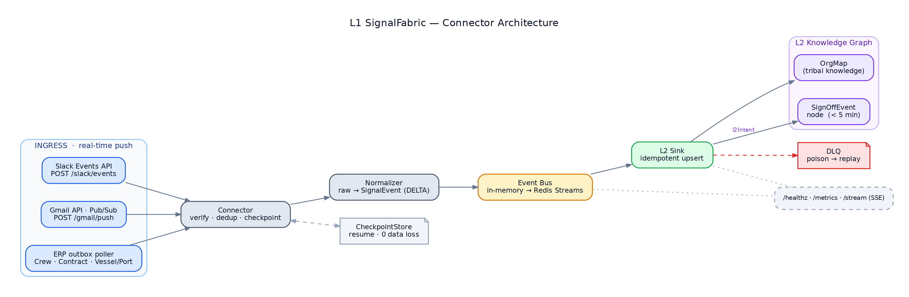
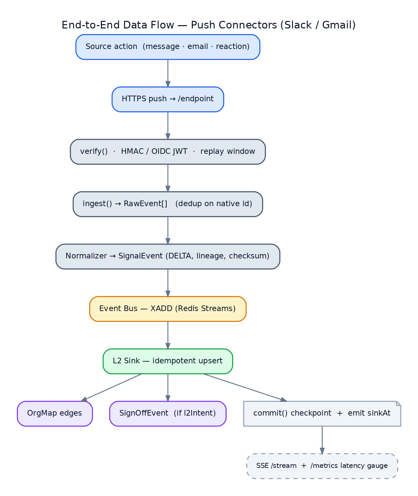
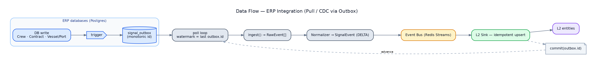

# L1 SignalFabric — Design Document

**Layer:** L1 SignalFabric
**Engineers:** Sreekumar M K, Sruthy
**Status:** Prototype design (for async review, due Jun 12, 2026)
**Prod target:** Jun 15, 2026
**Source:** `L1SignalFabric/` (new standalone module — extends the upstream batch pipeline without modifying it)

---

## 1. Purpose & Scope

L1 SignalFabric is the **continuous event-ingestion layer**. It converts real-world activity
(Slack, Gmail, ERP/operational databases) into a single canonical event stream that the **L2
knowledge graph** consumes to build **OrgMap** (tribal knowledge) and workflow nodes such as
**SignOffEvent**.

It extends the **upstream** medallion pipeline from *batch snapshots* to *continuous streams*.
The upstream pipeline ships file/batch adapters today: `SourceAdapter → FileExtractor` is live (Phase 1);
`APIExtractor` (Phase 2) and `CDCExtractor` (Phase 3) are stubbed for the future.
**L1 SignalFabric realizes Phase 3**: push connectors emitting the same canonical `Record`
shape as continuous `DELTA` operations.

### 1.1 In scope (prototype, build-first order)

| # | Connector | Upstream source(s) | Feeds | Ingestion |
|---|---|---|---|---|
| 1 | **Slack Events API** | Slack | OrgMap (tribal knowledge only) | webhook push |
| 2 | **Gmail API (Workspace)** | email sign-off events | OrgMap + **SignOffEvent** | Pub/Sub push, **metadata only** |
| 3 | **ERP Integration** | Crew DB · Contract (CLM) · Vessel/Port DB | L2 entities | CDC / outbox stream |

### 1.2 Out of scope (prototype)

- Email **body** content (Gmail = metadata only: sender, recipient, thread, timestamp).
- Backfill/historical batch import (that is the upstream pipeline's existing file path).
- L2 graph internals (we publish events; L2 owns graph mutation semantics beyond the sink).
- Multi-tenant fan-out tuning (single tenant for proto; `tenantId` carried on every event).

### 1.3 Design goals (traceable to exit criteria)

| Goal | Exit criterion |
|---|---|
| Continuous streams, never batch | All 5 sources streaming (not batch) |
| Sign-off email materializes a node fast | Sign-off email → L2 SignOffEvent < 5 min |
| Lossless under restart/failure | 50 crew records, 0 data loss |
| Low end-to-end latency | Changes propagate downstream < 5 min |

---

## 2. Connector Architecture

### 2.1 Component overview



### 2.2 The connector contract (`EventStreamConnector`)

Phase-3 analogue of the upstream stubbed `CDCExtractor` interface. Every connector implements the
same lifecycle so the core treats all sources uniformly.

```python
class EventStreamConnector(Protocol):
    name: str                       # "slack" | "gmail" | "erp.crew_db" | ...
    source_system: SourceSystem     # SLACK | EMAIL | CREW_DB | CONTRACT_CLM | VESSEL_PORT_DB

    def verify(self, request) -> VerifyResult:
        """Validate authenticity of an inbound push (HMAC / JWT) or a poll cycle.
        Returns CHALLENGE (echo handshake), OK, or REJECT."""

    async def ingest(self, raw) -> list[RawEvent]:
        """Turn one inbound payload (or poll batch) into 0..N RawEvents,
        applying idempotent de-duplication on the source's native id."""

    def position(self) -> Checkpoint:        # resume watermark (history_id / ts / updated_at)
    def commit(self, ckpt: Checkpoint): ...   # persist position after successful sink
```

Two ingestion modes, one contract:

- **Push connectors** (Slack, Gmail) — FastAPI route calls `verify()` then `ingest()`.
- **Pull/CDC connectors** (ERP) — a background task polls an `outbox`/watermark, calls
  `ingest()`, advances `position()`. Still emits **`DELTA`** (continuous), not `SNAPSHOT`.

### 2.3 Per-connector design

#### Slack Events API (Sreekumar)
- **Transport:** Slack Events API HTTP push → `POST /slack/events`. Socket Mode supported as
  a no-public-URL fallback for demos.
- **Auth:** `X-Slack-Signature` HMAC-SHA256 over `v0:{timestamp}:{body}`, with a ±5-min
  timestamp window to block replay. `url_verification` challenge handled in `verify()`.
- **Events handled:** `message`, `reaction_added`, `member_joined_channel`.
- **Dedup:** Slack `event_id` (X-Slack-Retry-Num retries are idempotent).
- **OrgMap mapping:** person ↔ channel membership, message authorship, reaction edges =
  tribal-knowledge signal. Field shape reuses the existing batch Slack scraper model.

#### Gmail API — Workspace (Sruthy)
- **Transport:** `users.watch()` → Google Cloud **Pub/Sub** topic → push subscription →
  `POST /gmail/push`.
- **Auth:** verify the Pub/Sub **OIDC JWT** (audience + Google signing keys).
- **Fetch:** push gives only a `historyId`; we call `users.history.list` then
  `users.messages.get` with **`format=metadata`** and an explicit `metadataHeaders` allow-list
  (`From,To,Cc,Subject,Date,Message-Id,References,In-Reply-To`). **Body is never requested.**
- **Mapping:** participants → OrgMap interaction edges; `References`/`In-Reply-To` →
  thread linkage.
- **Sign-off detection:** rule-based classifier (subject/label/sender allow-list, e.g.
  label `crew/sign-off` or subject matches a sign-off pattern) → emits a `SignOffEvent`
  intent on the canonical event (see §3.3).

#### ERP Integration (Sreekumar)
- **Sources:** Crew DB, Contract (CLM), Vessel/Port DB — modeled as Postgres (the project
  already runs Postgres, [`README.md`](../../README.md)).
- **CDC strategy (proto):** transactional **outbox** table (`signal_outbox`) populated by
  triggers on each tracked table, polled on a short interval; fallback is an `updated_at`
  high-watermark scan. Each change emits a **`DELTA`** record. (Prod path can swap to logical
  replication / Debezium behind the same connector contract.)
- **Watermark:** last consumed `outbox.id` (monotonic) stored in `CheckpointStore` → crash-safe
  resume with no gap and no replay duplication.

---

## 3. Stream Schema

### 3.1 `SignalEvent` — the canonical record

1:1 with the upstream `Record` so downstream stays batch-compatible. Difference from the
upstream file path: `operation` is always **`DELTA`**.

```jsonc
{
  "entity": "message",                       // message | reaction | channel_join | email | crew | contract | vessel_port
  "key": { "channel_id": "C005", "ts": "1719980964.000100" },  // source-natural primary key
  "sourceSystem": "SLACK",                   // SLACK | EMAIL | CREW_DB | CONTRACT_CLM | VESSEL_PORT_DB
  "tenantId": "maritime-acme",
  "operation": "DELTA",                      // always DELTA in L1 (continuous)
  "data": { /* normalized, source-specific fields (metadata only for Gmail) */ },
  "timestamp": "2026-06-10T14:30:52Z",       // when the event was valid at source
  "extractedAt": "2026-06-10T14:30:53Z",     // when L1 received it  (latency start)
  "lineage": {
    "extractionId": "slack-evt-20260610-143052-a1b2",
    "sourceEndpoint": "/slack/events",       // or "/gmail/push", "erp.outbox"
    "sourceSequence": 10432,                 // outbox id / gmail historyId
    "checksum": "sha256:…"                   // integrity of raw payload
  },
  "metadata": {
    "schemaVersion": "1.0",
    "custom": { "eventId": "Ev0xx", "deliveryAttempt": "1", "sinkAt": "2026-06-10T14:30:54Z" }
  }
}
```

`metadata.custom.sinkAt − extractedAt` = the **propagation latency** measured against the
< 5-min SLO.

### 3.2 Per-source `data` payloads

| sourceSystem | entity | `data` fields (normalized) |
|---|---|---|
| SLACK | `message` | `channel`, `user{id,name,email}`, `text`, `thread_ts`, `reply_count` |
| SLACK | `reaction` | `channel`, `user`, `target_ts`, `reaction` |
| SLACK | `channel_join` | `channel`, `user`, `inviter?` |
| EMAIL | `email` | `from`, `to[]`, `cc[]`, `subject`, `thread_id`, `references[]`, `sent_at` — **no body** |
| CREW_DB | `crew` | `crew_id`, `name`, `rank`, `vessel_id`, `status`, `updated_at` |
| CONTRACT_CLM | `contract` | `contract_id`, `crew_id`, `type`, `state`, `effective_from/to` |
| VESSEL_PORT_DB | `vessel_port` | `vessel_id`, `port`, `eta`, `status` |

### 3.3 SignOffEvent envelope (the < 5-min trigger)

When the Gmail connector classifies a message as a sign-off, the `SignalEvent` carries a
materialization intent the L2 sink acts on:

```jsonc
{
  "entity": "email", "sourceSystem": "EMAIL", "operation": "DELTA",
  "data": { "from": "captain@…", "to": ["crewops@…"], "subject": "Sign-off: …",
            "thread_id": "…", "sent_at": "…" },
  "metadata": { "custom": {
      "l2Intent": "CREATE_SIGNOFF_EVENT",
      "crewRef": "<resolved crew_id or email>",
      "vesselRef": "<resolved vessel_id?>" } }
}
```

The L2 sink, on seeing `l2Intent=CREATE_SIGNOFF_EVENT`, upserts a **SignOffEvent** node
(idempotent on `thread_id`+`crewRef`) — satisfying the exit criterion.

---

## 4. Event Bus & Delivery Semantics

- **Bus:** `InMemoryBus` for Day-1 demo → **`RedisStreamsBus`** for durability + replay
  (consumer groups, `XACK`, pending-entry reclaim).
- **Delivery:** **at-least-once**. The L2 sink is **idempotent** (upsert on canonical `key` +
  `sourceSequence`), so at-least-once is safe end-to-end.
- **Ordering:** per-`key` ordering preserved by routing a key to a single stream partition;
  global ordering not required (events are independently keyed).
- **Backpressure:** bounded stream length; producers block/spill to checkpoint rather than drop.
- **DLQ:** after N retries a message moves to `signal.dlq` with the failure reason; a replay
  tool re-injects after fix.
- **Checkpointing:** `commit()` runs only **after** the sink acks → guarantees 0 loss across
  restart (the connector resumes from the last committed `position()`).

---

## 5. Data Flow

### 5.1 End-to-end (push: Slack / Gmail)



### 5.2 ERP (pull/CDC)



### 5.3 Latency budget (target < 5 min; expected « 1 s for push)

| Hop | Push (Slack/Gmail) | ERP (poll) |
|---|---|---|
| source → L1 ingress | network (~ms) | ≤ poll interval (≤ 5 s) |
| verify + normalize | ~ms | ~ms |
| bus → sink | ~ms–s | ~ms–s |
| **observed E2E** | **sub-second** | **< 6 s** |

Headroom against the 5-min SLO is large; the SLO mainly guards Gmail's Pub/Sub delivery and
`history.list` pagination under load.

---

## 6. Upstream Extension Approach

| Upstream concept | L1 SignalFabric realization |
|---|---|
| `CDCExtractor` (Phase 3, stubbed) | `EventStreamConnector` — `verify/ingest/position/commit` |
| `SubscribeChanges()` | push routes (`/slack/events`, `/gmail/push`) + ERP outbox poller |
| `GetCDCPosition()` | `position()` + `CheckpointStore` |
| `Record` | `SignalEvent` (same fields; `operation=DELTA`) |
| `SourceSystem` enum (`SLACK`,`EMAIL`,…) | extended with `CREW_DB`,`CONTRACT_CLM`,`VESSEL_PORT_DB` |
| `DataStream` / `RecordStream` | `EventBus` (in-mem → Redis Streams) |
| Bronze JSONL sink | `L2Sink` (OrgMap upsert + SignOffEvent) |
| Batch Slack scraper | replaced by push connectors (history → real-time) |

**Why a separate service:** L1 SignalFabric lives in its own `L1SignalFabric/` module without
modifying the existing upstream codebase. We **vendor the contract** (`Record`/`SourceSystem`
shapes) into `L1SignalFabric/core/` and keep wire compatibility, so this folds back into
the upstream pipeline later as its real Phase-3 `CDCExtractor` implementations.

---

## 7. Technology & Module Layout

- **Runtime:** Python 3.12, FastAPI, asyncio (matches project stack, [`README.md`](../../README.md)).
- **Bus/state:** Redis (Streams + checkpoints); Postgres for ERP sources + outbox.
- **Observability:** Prometheus `/metrics`, structured JSON logs, SSE `/stream` live tail.
- **External SDKs:** `slack_sdk`, Google API client (`google-api-python-client`,
  `google-cloud-pubsub`).

```
L1SignalFabric/
├── core/            # SignalEvent, SourceSystem, EventStreamConnector, EventBus, CheckpointStore
├── connectors/
│   ├── slack/       # events receiver, signature verify, normalizer
│   ├── gmail/       # pubsub push, watch(), metadata fetch, sign-off classifier
│   └── erp/         # outbox poller, crew/contract/vessel_port normalizers
├── sink/            # L2Sink (OrgMap upsert + SignOffEvent), DLQ
├── api/             # FastAPI routes: /slack/events /gmail/push /healthz /metrics /stream
├── scripts/         # inject_mock.py, replay.py, seed_erp.py
├── tests/           # see Test Doc
├── docs/            # PLAN.md, DESIGN.md, TEST.md (+ .docx)
└── docker-compose.yml / Makefile   # make demo-day1..5
```

---

## 8. Security & Privacy

- **Inbound authenticity:** Slack HMAC + timestamp window; Gmail Pub/Sub OIDC JWT verification.
- **Least data:** Gmail metadata-only (header allow-list); no message body ever fetched/stored.
- **Secrets:** tokens via env/secret manager; never logged. Mirrors the managed-agents
  boundary — no source bodies/secrets enter hosted containers ([`ARCHITECTURE.md`](../../ARCHITECTURE.md) §0).
- **Idempotency keys** double as replay protection (Slack `event_id`, Pub/Sub `messageId`,
  outbox `id`).
- **PII:** OrgMap stores identities/edges; access controlled at L2. L1 carries `tenantId` on
  every event for isolation.

---

## 9. Risks & Mitigations

| Risk | Mitigation |
|---|---|
| No public URL for webhooks during dev/demo | Slack Socket Mode; ngrok/Cloud Run tunnel; `replay.py` recorded payloads |
| Pub/Sub or Workspace not provisioned in time | Pub/Sub emulator + recorded push payloads on the same `/gmail/push` code path |
| Duplicate deliveries (Slack retries, Pub/Sub redelivery) | idempotent sink + native-id dedup |
| Connector crash mid-stream | checkpoint-after-ack → resume with 0 loss/0 dup |
| Poison message stalls a stream | retry budget → DLQ + alert |
| Gmail body accidentally fetched | hard-coded `format=metadata` + header allow-list; unit test asserts no body field |

---

## 10. Open Questions (for async review)

1. L2 sink interface — does L2 expose a direct API/SDK, or do we publish to a topic L2 consumes?
2. SignOffEvent identity — canonical on `thread_id`+`crewRef`, or an L2-issued id?
3. ERP CDC in prod — outbox+triggers (proto) vs logical replication/Debezium (prod)?
4. Tenant model — single tenant for proto; confirm prod multi-tenant routing on `tenantId`.
</content>
