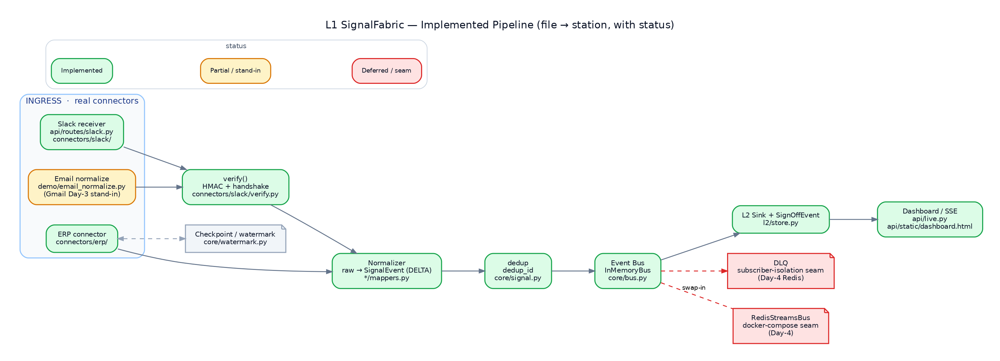
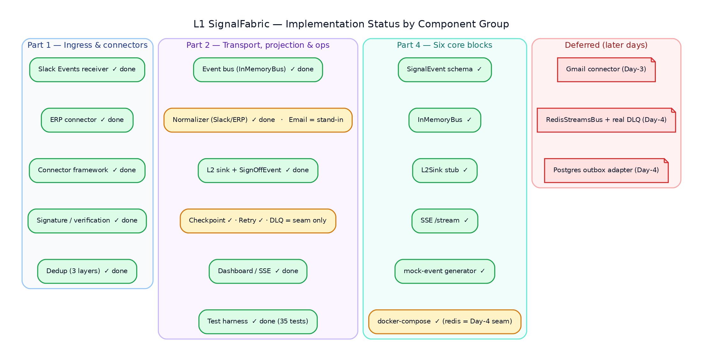

# L1 SignalFabric — Implementation Details

**Layer:** L1 SignalFabric (continuous event ingestion for the Maritime Crew Orchestrator)
**Module:** `L1SignalFabric/`
**Audience:** engineers integrating with, extending, or reviewing the ingress layer

This document is the **component-by-component implementation map**. For each building
block it states the **Role & Responsibility** (what it owns) and **Where it is
implemented in code** (the exact file, class, and function). Companion docs:
[`DESIGN.md`](DESIGN.md) (the why), [`PLAN.md`](PLAN.md) (the build order),
[`TEST.md`](TEST.md) (the test strategy), and [`COMPONENTS.md`](COMPONENTS.md) (the
six-component status map).

---

## 0. The pipe at a glance

Every source event takes the same path. The components below are the stations on it:

```
raw source event
   │  (Slack webhook · ERP outbox row · Gmail-style email)
   ▼
[ verify ]            ── signature / handshake / authenticity
   ▼
[ ingest / normalize ] ── raw payload → canonical SignalEvent(s)
   ▼
[ dedup ]            ── stable dedup_id drops at-least-once duplicates
   ▼
[ event bus ]        ── publish + fan-out to subscribers
   ▼
[ L2 sink ]          ── project SignalEvent → OrgMap edge / node / SignOffEvent
   ▼
[ dashboard / SSE ]  ── live per-stage view in the browser
```



Two design invariants thread through every component:

1. **One canonical shape.** Every connector emits `SignalEvent` (`core/signal.py`) and
   nothing downstream knows the source's native format.
2. **One seam.** Connectors and routes depend only on the `EventBus` Protocol
   (`core/bus.py`); concrete buses (`LoggingEventBus`, `InMemoryBus`, `BroadcastBus`,
   the Day-4 `RedisStreamsBus`) drop in with **no change to any connector or route**.

---

## 0.1 Implementation status

The whole Day-1 scope is **implemented and tested** (35 passing tests). Two
components are intentionally **partial** (a labelled stand-in or a documented seam),
and three are **deferred** to later days behind the same Protocols. The map below is
colour-coded; the table that follows is the authoritative per-component status.



Legend: ✅ **Done** (implemented + tested) · 🟡 **Partial** (works, but a stand-in or
seam, not the production form) · ⛔ **Deferred** (later day, Protocol/seam in place).

| Component | Status | Where | Notes |
|---|---|---|---|
| Slack Events receiver | ✅ Done | `api/routes/slack.py`, `connectors/slack/` | handshake + signature + ingest + `event_id` dedup |
| ERP connector | ✅ Done | `connectors/erp/` | outbox poll + watermark + 3 source systems |
| Connector framework | ✅ Done | `core/connector.py` | `EventStreamConnector` + verify/ingest/position/commit |
| Signature / verification | ✅ Done | `connectors/slack/verify.py` | constant-time HMAC + replay window + dev bypass |
| Dedup | ✅ Done | `core/signal.py`, `core/dedup.py`, `core/bus.py` | three layers (connector-local · `dedup_id` · bus LRU) |
| Event bus | ✅ Done | `core/bus.py` | `InMemoryBus`: dedup + fan-out + replay + stats |
| Normalizer (Slack, ERP) | ✅ Done | `connectors/*/mappers.py` | pure, fixture-tested |
| Normalizer (Email) | 🟡 Partial | `demo/email_normalize.py` | labelled stand-in for the Day-3 Gmail connector |
| L2 sink + SignOffEvent | ✅ Done | `l2/store.py` | JSONL projection; SignOffEvent node materialized |
| Checkpoint | ✅ Done | `core/watermark.py` | in-memory + file stores; lossless resume |
| Retry (idempotency) | ✅ Done | `core/bus.py` + dedup layers | retried poll/redelivery is safe |
| DLQ | 🟡 Partial | `core/bus.py` (`publish` `try/except`) | subscriber-isolation **seam** only; durable DLQ is Day-4 |
| Dashboard / SSE | ✅ Done | `api/live.py`, `api/static/dashboard.html` | per-stage counts + trace + sparkline |
| Test harness | ✅ Done | `tests/` (35), `scripts/` | contract → e2e + smoke |
| SignalEvent schema | ✅ Done | `core/signal.py` | canonical model + enums + `dedup_id` |
| InMemoryBus | ✅ Done | `core/bus.py` | the six-block bus |
| L2Sink stub | ✅ Done | `l2/store.py` | the six-block sink |
| SSE `/stream` | ✅ Done | `api/live.py` | snapshot + live rows + keepalive |
| Mock-event generator | ✅ Done | `demo/generator.py`, `seed.py`, `stream.py` | deterministic multi-source clusters |
| docker-compose | ✅ Done | `docker-compose.yml` | service ✅; `redis` shipped as the Day-4 seam |
| Gmail connector | ⛔ Deferred | (Day-3) | Pub/Sub push + OIDC verify + `history.list` |
| RedisStreamsBus + durable DLQ | ⛔ Deferred | (Day-4) | same `EventBus` Protocol; `redis` seam already in compose |
| Postgres outbox adapter | ⛔ Deferred | (Day-4) | swap `InMemoryOutboxAdapter`; connector/mappers unchanged |

---

# Part 1 — Ingress & connector foundation

> Slack Events receiver · ERP connector · connector framework · signature/verification · dedup


## 1.1 Slack Events receiver

**Role & Responsibility.** Accept inbound Slack Events API HTTP pushes, authenticate
them, normalize each `event_callback` into `SignalEvent`s, and publish to the bus — while
acking within Slack's 3-second budget. Handles the `url_verification` handshake, HMAC
signature verification, per-`event_id` idempotency, and fan-out to the per-type mappers
(message / reaction_added / member_joined_channel).

**Where it is implemented in code.**

| Concern | Location |
|---|---|
| HTTP route (transport glue only) | [`api/routes/slack.py`](../api/routes/slack.py) — `slack_events()` (`POST /slack/events`) |
| Connector logic | [`connectors/slack/connector.py`](../connectors/slack/connector.py) — `SlackConnector.verify()` / `.ingest()` |
| Raw → SignalEvent mappers | [`connectors/slack/mappers.py`](../connectors/slack/mappers.py) — `map_message`, `map_reaction`, `map_member_joined`, `MAPPERS` |

The route is intentionally thin: it reads the raw body, wraps it in an
`InboundRequest`, calls `connector.verify(...)`, and either echoes the challenge
(`CHALLENGE`), returns 401 (`REJECT`), or normalizes-and-publishes (`OK`). All
Slack-specific logic lives in the connector, so it is unit-testable without a web
server. The `event.type → mapper` dispatch table (`MAPPERS`) means unhandled event
types are silently ignored (return `[]`) rather than erroring.


## 1.2 ERP connector

**Role & Responsibility.** Pull/CDC connector covering the **three** ERP source systems
(Crew DB, Contract/CLM, Vessel/Port DB) through a single transactional-**outbox** feed.
It composes a swappable fetch adapter + the shared row mapper + a watermark, so polling
**resumes losslessly across restarts** (the "50 records, 0 data loss" exit criterion).
The `table` field on each outbox row selects the target source system and entity.

**Where it is implemented in code.**

| Concern | Location |
|---|---|
| Connector (poll / position / commit / ingest) | [`connectors/erp/connector.py`](../connectors/erp/connector.py) — `ErpConnector` |
| Fetch adapter contract + mimic | [`connectors/erp/adapter.py`](../connectors/erp/adapter.py) — `ErpFetchAdapter` (ABC), `InMemoryOutboxAdapter`, `RawRecord` |
| Outbox row → SignalEvent | [`connectors/erp/mappers.py`](../connectors/erp/mappers.py) — `outbox_row_to_signal`, `TABLE_MAP` |

`poll()` fetches new rows since the cursor, maps each to `SignalEvent`s, and advances
the watermark **per row after** its signals are produced. Because every event carries a
stable `dedup_id` (folding in `source_sequence`), a retried poll is safe — duplicates are
dropped downstream. The adapter is the **only** part that changes to go live: swap
`InMemoryOutboxAdapter` for a Postgres `signal_outbox` poller or Debezium feed; connector
and mappers are unchanged.


## 1.3 Connector framework (`EventStreamConnector`)

**Role & Responsibility.** The uniform lifecycle every source implements, so the core
treats push (webhook) and pull (CDC/outbox) connectors identically. It is the L1
realization of the upstream stubbed Phase-3 `CDCExtractor`. Defines the four lifecycle
methods and the framework-agnostic request/result value types so connectors never depend
on the web framework.

**Where it is implemented in code.** [`core/connector.py`](../core/connector.py):

| Symbol | Responsibility |
|---|---|
| `EventStreamConnector` (ABC) | `verify(request)` → `VerifyResult`; `ingest(raw)` → `list[SignalEvent]` (abstract); `position()` / `commit(ckpt)` for pull connectors (default no-op) |
| `InboundRequest` | Framework-agnostic view of an inbound HTTP push (case-insensitive `header()` lookup) — the FastAPI route adapts Starlette's `Request` into this |
| `VerifyResult` / `VerifyOutcome` | The verify contract: `OK` (proceed), `CHALLENGE` (echo handshake value), `REJECT` (401 + reason); constructors `.ok()`, `.challenge_with()`, `.reject()` |
| `Checkpoint` | Type alias for a resume position (outbox seq, ISO timestamp, Gmail historyId, …) |

Push connectors override `verify` + `ingest`; pull connectors additionally use
`position`/`commit`. Sensible defaults mean each connector implements only what it needs.

## 1.4 Signature / verification

**Role & Responsibility.** Prove an inbound Slack request is authentic before any event is
ingested. Recompute Slack's HMAC-SHA256 over `v0:{timestamp}:{raw_body}` keyed by the
signing secret, compare in **constant time**, and reject **stale** timestamps to block
replay. A dev bypass keeps the demo runnable with no secret configured.

**Where it is implemented in code.**

| Concern | Location |
|---|---|
| HMAC verification primitive | [`connectors/slack/verify.py`](../connectors/slack/verify.py) — `verify_slack_signature()`, `SignatureCheck` |
| Verify policy (handshake → signature → dev-bypass) | [`connectors/slack/connector.py`](../connectors/slack/connector.py) — `SlackConnector.verify()` |
| Config knobs | [`config.py`](../config.py) — `slack_signing_secret`, `slack_dev_allow_unverified`, `slack_replay_window_sec` |

`verify_slack_signature` uses `hmac.compare_digest` (constant-time) and enforces the
replay window (`abs(now - ts) > replay_window_sec` → reject). The connector's policy
order is: (1) `url_verification` handshake → return the challenge; (2) signing secret
configured → verify the signature; (3) no secret + `dev_allow_unverified` → accept with a
warning, else reject. The `now` parameter is injectable so tests can assert the
stale-timestamp path deterministically.

## 1.5 Dedup (idempotency)

**Role & Responsibility.** Turn the connectors' **at-least-once** delivery into
**exactly-once** downstream. Provide a stable identity for an event so the same source
event ingested twice yields the same key and the bus/sink can drop the duplicate. There
are **three** complementary layers of de-duplication.

**Where it is implemented in code.**

| Layer | Location | What it dedups |
|---|---|---|
| Canonical-event identity | [`core/signal.py`](../core/signal.py) — `SignalEvent.dedup_id` (property) | sha256 of `(source_system, entity, sorted key, source_sequence)` — the bus-level dedup key |
| Raw-payload helper | [`core/dedup.py`](../core/dedup.py) — `dedup_key()` | hashes a raw payload **before** a SignalEvent exists (natural keys or whole payload) |
| Connector-local Slack guard | [`connectors/slack/connector.py`](../connectors/slack/connector.py) — `_seen_event_ids` set | drops a re-delivered Slack `event_id` at ingest time (Day-1; folds into bus dedup later) |
| ERP idempotent resume | [`core/watermark.py`](../core/watermark.py) + `ErpConnector.poll` | the watermark means a retried poll re-reads nothing past the cursor |

The bus enforces dedup centrally (§2.1) using `dedup_id`; the connector-local guards and
the watermark are upstream optimizations that keep duplicates from even reaching the bus.


---

# Part 2 — Transport, projection & operations

> Event bus · normalizer · L2 sink + SignOffEvent · checkpoint/retry/DLQ · dashboard · test harness

## 2.1 Event bus

**Role & Responsibility.** The agreed seam between the ingress track and the core/sink
track. Anything a connector can publish a normalized event to. Three concrete
implementations exist behind one Protocol, each adding capability:

- **idempotency** — duplicate `dedup_id` events are dropped (LRU window keeps memory flat);
- **fan-out** — subscribers (the L2 sink) receive every new event; a failing subscriber is
  isolated and logged, never dropping the event for the others;
- **replay** — a bounded ring buffer brings a late subscriber/viewer immediately current.

**Where it is implemented in code.** [`core/bus.py`](../core/bus.py):

| Symbol | Role |
|---|---|
| `EventBus` (runtime-checkable Protocol) | the contract — `async publish(event)` — connectors/routes depend only on this |
| `LoggingEventBus` | Day-1 placeholder: logs + keeps last N (no subscribers/durability) |
| `InMemoryBus` | production-shaped bus: dedup (`_seen` LRU + `_dedup_window`), `subscribe`/`unsubscribe` fan-out, `replay()`, `stats()`, and a bounded console log (`recent_log`) for the UI |

`InMemoryBus.publish` checks `dedup_id` against the LRU set, drops + counts duplicates,
else appends to history, bumps the per-source/per-entity counters, and fans out to
subscribers (awaiting async ones via `inspect.isawaitable`). The viewer bus
`BroadcastBus` (§2.5) implements the same Protocol and *taps* an `InMemoryBus` purely to
surface its `PUBLISH`/`DUP-DROP` console log in the dashboard. The Day-4 `RedisStreamsBus`
will implement the same `publish`/`subscribe`/`replay` surface — swap-in by construction.


## 2.2 Normalizer

**Role & Responsibility.** Convert each source's native payload into the canonical
`SignalEvent` — the "raw → SignalEvent" seam. Normalizers are **pure** (no I/O, no clock
beyond supplied timestamps) so they are proven against recorded fixtures and reused
unchanged regardless of transport (HTTP Events API vs Socket Mode; webhook vs poll).

**Where it is implemented in code.** One normalizer per source family:

| Source | Location | Notes |
|---|---|---|
| Slack | [`connectors/slack/mappers.py`](../connectors/slack/mappers.py) | `map_message` / `map_reaction` / `map_member_joined`; `_ts_to_dt` parses Slack epoch `ts` |
| ERP | [`connectors/erp/mappers.py`](../connectors/erp/mappers.py) | `outbox_row_to_signal`; `TABLE_MAP` routes `table` → (source_system, entity, pk) |
| Email | [`demo/email_normalize.py`](../demo/email_normalize.py) | `email_to_signal`; **labelled demo stand-in** for the Day-3 Gmail connector — metadata only, no body; sets `l2Intent=CREATE_SIGNOFF_EVENT` on sign-off mail |

Email normalization lives under `demo/` (not `connectors/`) deliberately: the real Gmail
connector (Pub/Sub push + OIDC verify + `history.list`) is Day-3 work and will replace it.

## 2.3 L2 sink + SignOffEvent

**Role & Responsibility.** The downstream end of the demo pipe: subscribe to the bus and
**project** each canonical `SignalEvent` into the L2 store (a lightweight stand-in for the
real OrgMap + SignOffEvent knowledge graph). Slack events become OrgMap edges, ERP rows
become entity nodes, and a sign-off email (`l2Intent=CREATE_SIGNOFF_EVENT`) materializes a
dedicated **SignOffEvent** node.

**Where it is implemented in code.** [`l2/store.py`](../l2/store.py):

| Symbol | Role |
|---|---|
| `L2JsonlStore.project()` (static, pure) | `SignalEvent` → L2 record: `signoff_event` \| `edge` \| `node` |
| `L2JsonlStore.append()` | project + persist one record to append-only JSONL; updates `by_kind`/`by_label`/`signoff` counters and `recent` |
| `_SLACK_LABEL` / `_ERP_LABEL` | edge/node label maps (POSTED_IN / REACTED_IN / MEMBER_OF; Crew / Contract / Vessel) |

Wiring (in [`api/app.py`](../api/app.py) `create_app`): for an `InMemoryBus` the sink is
attached via `bus.subscribe(store.append)` (fan-out); for the default `BroadcastBus` it is
attached via `bus.set_sink(store.append)`. The **SignOffEvent** rule is the demo's payoff:
`project()` checks `metadata.l2Intent == "CREATE_SIGNOFF_EVENT"` first and emits a
`signoff_event` node carrying subject/from/thread_id. Sruthy's real graph sink implements
the same "subscribe to the bus, write downstream" contract.

## 2.4 Checkpoint / retry / DLQ

**Role & Responsibility.** Make ingestion **lossless and safe to retry**. Persist a
source's progress (checkpoint/watermark) only after the sink acks, so a restart resumes
exactly where it left off; tolerate redelivery (retry) via dedup; isolate poison
subscribers so one bad consumer never drops events for the others.

**Where it is implemented in code.**

| Concern | Location |
|---|---|
| Watermark stores | [`core/watermark.py`](../core/watermark.py) — `WatermarkStore` (ABC), `InMemoryWatermarkStore` (tests), `FileWatermarkStore` (survives restart) |
| Checkpoint contract | [`core/connector.py`](../core/connector.py) — `position()` / `commit(checkpoint)`; `Checkpoint` alias |
| ERP checkpoint use | [`connectors/erp/connector.py`](../connectors/erp/connector.py) — `ErpConnector.poll` commits the cursor per row |
| Retry safety (idempotency) | [`core/bus.py`](../core/bus.py) `InMemoryBus.publish` dedup; §1.5 dedup layers |
| Subscriber isolation (DLQ seam) | [`core/bus.py`](../core/bus.py) — `try/except` around each subscriber: `SUBSCRIBER-FAIL` logged, event preserved for others |

> **Scope note.** A *dedicated* dead-letter queue is **not yet a standalone component** in
> this scaffold — its seam is the subscriber-isolation `try/except` in
> `InMemoryBus.publish`, which today logs `SUBSCRIBER-FAIL` and counts it rather than
> routing the failed event to a durable DLQ. The Day-4 `RedisStreamsBus` is where a real
> DLQ (Redis Streams `XCLAIM`/pending-entries-list) lands behind the same Protocol.
> Checkpointing and retry are fully implemented; DLQ is a documented seam.

## 2.5 Dashboard

**Role & Responsibility.** Visualize the **whole pipe** in the browser — per-stage live
counts (ingress → normalized → bus → L2 → tail), a "Run Demo 1" trace showing
`raw → normalized → L2 record` for each event, a signals/sec sparkline, and
Start-live / Load-history controls to replay the generated dataset. It is driven by a
viewer bus that fans events out over Server-Sent Events.

**Where it is implemented in code.**

| Concern | Location |
|---|---|
| Viewer bus + SSE + demo routes | [`api/live.py`](../api/live.py) — `BroadcastBus`, `GET /` (dashboard), `GET /stream` (SSE), `GET /bus/log`, `POST /demo/{inject,start,backlog,stop}`, `GET /demo/status` |
| Single-file UI | [`api/static/dashboard.html`](../api/static/dashboard.html) |
| Demo orchestration (single injection) | [`api/live.py`](../api/live.py) — `demo_inject`, `_mock_pair` (one coherent Slack msg + sign-off email + ERP row) |
| Headless Demo-1 driver | [`scripts/demo1.py`](../scripts/demo1.py) |

`BroadcastBus` implements the `EventBus` Protocol, runs the L2 sink on every publish,
tracks the per-stage counters (`ingress`/`total`/`l2`/`signoff`), and pushes each event as
an SSE payload carrying the full `raw → normalized → l2_record` trace. The `/stream`
generator emits a `snapshot` first (to bring a fresh tab current), then live rows with a
15-second keepalive. Slow clients drop lines (`QueueFull`) but totals stay authoritative.

## 2.6 Test harness

**Role & Responsibility.** Prove each component and the end-to-end pipe without external
services. Covers the contract, the canonical model, signature verification, ERP watermark
losslessness, the InMemoryBus, the L2 projection pipe, the live/SSE surface, the API, and
the demo streamer — plus an in-process smoke script.

**Where it is implemented in code.** [`tests/`](../tests/) (35 tests) + scripts:

| File | Proves |
|---|---|
| [`tests/test_contract.py`](../tests/test_contract.py) | Slack & ERP connectors satisfy `EventStreamConnector` |
| [`tests/test_signal.py`](../tests/test_signal.py) | `SignalEvent` defaults (DELTA, event_id), tz-aware validation, `dedup_id`/`dedup_key` stability |
| [`tests/test_slack_signature.py`](../tests/test_slack_signature.py) | valid / tampered / stale signature, and route rejects unsigned when a secret is set |
| [`tests/test_erp.py`](../tests/test_erp.py) | outbox → 3 source systems, watermark advance / no redelivery, lossless file-watermark resume |
| [`tests/test_inmemory_bus.py`](../tests/test_inmemory_bus.py) | Protocol conformance, ordered fan-out, async await, dedup, subscriber isolation, replay, `create_app` wiring |
| [`tests/test_l2_pipe.py`](../tests/test_l2_pipe.py) | L2 projection, `demo/inject` whole-pipe flow, `/healthz` stage reporting |
| [`tests/test_live.py`](../tests/test_live.py) | `BroadcastBus` fan-out/counts, `/bus/log`, dashboard served, idle `/demo/status` |
| [`tests/test_api.py`](../tests/test_api.py) | `/healthz`, handshake, message ingest publishes, duplicate dedup, unhandled-type ignore |
| [`tests/test_demo_stream.py`](../tests/test_demo_stream.py) | seed split, backlog drains all sources + idempotent second pass, live replay time-ordering |
| [`scripts/smoke.py`](../scripts/smoke.py) | in-process Day-1 ingress smoke (`make smoke`) |

Run with `make test` (pytest) or `make smoke`.


---

# Part 3 — Day-1 scaffold (the foundation that was laid first)

> Scaffold · `EventStreamConnector` interface · Slack & ERP skeletons · Slack URL-verify handshake

This part records the **initial scaffold** — the first runnable slice that everything
above builds on. (It overlaps Part 1 by design; here the lens is "what landed on Day 1".)

## 3.1 Project scaffold

**Role & Responsibility.** A fresh checkout boots and the Day-1 demo runs with **no
secrets** — env-driven config with dev-safe defaults, a FastAPI application factory wiring
connectors + bus + routes, container packaging, and Make targets.

**Where it is implemented in code.**

| Concern | Location |
|---|---|
| App factory (wires connectors + bus + L2 + routes) | [`api/app.py`](../api/app.py) — `create_app()` |
| ASGI entrypoint | [`main.py`](../main.py), and `uvicorn api.app:app` |
| Config (env + dev-safe defaults) | [`config.py`](../config.py) — `Settings`, `SERVICE_NAME`, `SERVICE_VERSION` |
| Health endpoint | [`api/routes/health.py`](../api/routes/health.py) — `GET /healthz` |
| Packaging / commands | [`Dockerfile`](../Dockerfile), [`Makefile`](../Makefile), [`requirements.txt`](../requirements.txt), [`pyproject.toml`](../pyproject.toml) |

## 3.2 `EventStreamConnector` interface

**Role & Responsibility.** The agreed connector contract laid down first so both tracks
build against it (see §1.3 for the full method-by-method breakdown).

**Where it is implemented in code.** [`core/connector.py`](../core/connector.py) —
`EventStreamConnector`, `InboundRequest`, `VerifyResult`, `VerifyOutcome`, `Checkpoint`.

## 3.3 Slack & ERP skeletons

**Role & Responsibility.** Minimal-but-real connector skeletons proving the push and pull
shapes against the interface: Slack (verify + ingest + mappers, `event_id` dedup) and ERP
(outbox adapter + watermark + per-table mappers).

**Where it is implemented in code.**

| Skeleton | Location |
|---|---|
| Slack | [`connectors/slack/`](../connectors/slack/) — `connector.py`, `verify.py`, `mappers.py` |
| ERP | [`connectors/erp/`](../connectors/erp/) — `connector.py`, `adapter.py`, `mappers.py` |

## 3.4 Slack URL-verify handshake

**Role & Responsibility.** Handle the one-time `url_verification` request Slack sends when
you set the Request URL — echo the `challenge` value back as plain text and do **not**
ingest it. This is what lets a real Slack app register against the endpoint.

**Where it is implemented in code.**

| Step | Location |
|---|---|
| Detect handshake, return `CHALLENGE` | [`connectors/slack/connector.py`](../connectors/slack/connector.py) — `SlackConnector.verify()` (first branch) |
| Carry the challenge value | [`core/connector.py`](../core/connector.py) — `VerifyResult.challenge_with()` |
| Echo it as plain text | [`api/routes/slack.py`](../api/routes/slack.py) — `slack_events()` `CHALLENGE` branch → `PlainTextResponse` |
| Test | [`tests/test_api.py`](../tests/test_api.py) — `test_slack_url_verification_handshake` |

```bash
curl -sX POST localhost:8001/slack/events \
  -H 'content-type: application/json' \
  -d '{"type":"url_verification","challenge":"abc123"}'      # -> abc123
```

---

# Part 4 — The six core building blocks

> SignalEvent schema · InMemoryBus · L2Sink stub · SSE `/stream` · mock-event generator · docker-compose

These are the six components tracked in [`COMPONENTS.md`](COMPONENTS.md). (Several are also
covered above from a different angle; this part is the canonical six-block reference.)


## 4.1 SignalEvent schema

**Role & Responsibility.** The single canonical event model every connector emits and the
bus / L2 sink consume. 1:1 with the upstream `Record` (entity, key, sourceSystem,
tenantId, data, operation, timestamp, lineage) so the stream stays batch-compatible — the
only L1 difference is that streams are continuous, so `operation` is always `DELTA`. It
also owns the canonical dedup identity and the timezone-aware-timestamp guarantee.

**Where it is implemented in code.** [`core/signal.py`](../core/signal.py):

| Symbol | Role |
|---|---|
| `SignalEvent` (pydantic model) | the canonical event; `dedup_id` property; `_require_tz` validator (rejects naive timestamps) |
| `SourceSystem` (enum) | `SLACK`, `EMAIL`, `CREW_DB`, `CONTRACT_CLM`, `VESSEL_PORT_DB` |
| `Operation` (enum) | `DELTA` (L1 default), `SNAPSHOT` (upstream batch parity) |
| `Lineage` | provenance: extraction_id, source_endpoint, source_sequence, checksum |

Dependency-light (pydantic only) so it can be vendored back upstream unchanged.

## 4.2 InMemoryBus

**Role & Responsibility.** The Day-1 production-shaped bus — idempotency (dedup), subscriber
fan-out, and replay — behind the `EventBus` Protocol. See §2.1 for the full behavior.

**Where it is implemented in code.** [`core/bus.py`](../core/bus.py) — `InMemoryBus`
(`publish`, `subscribe`/`unsubscribe`, `replay`, `stats`, `recent_log`). Wired via
`create_app(bus=InMemoryBus())` in [`api/app.py`](../api/app.py); proven in
[`tests/test_inmemory_bus.py`](../tests/test_inmemory_bus.py).

## 4.3 L2Sink stub

**Role & Responsibility.** Project published `SignalEvent`s into the L2 store (OrgMap
edges / entity nodes / **SignOffEvent** nodes) — the demo pipe's downstream end. See §2.3.

**Where it is implemented in code.** [`l2/store.py`](../l2/store.py) — `L2JsonlStore`
(`project` pure projection, `append` persist). Subscribed/sinked in
[`api/app.py`](../api/app.py); proven in [`tests/test_l2_pipe.py`](../tests/test_l2_pipe.py).

## 4.4 SSE `/stream`

**Role & Responsibility.** Stream live pipeline activity to the browser over Server-Sent
Events: an initial snapshot then per-event rows with full stage traces, with keepalives and
slow-client tolerance. See §2.5.

**Where it is implemented in code.** [`api/live.py`](../api/live.py) — `GET /stream`,
`BroadcastBus.subscribe`/`_fanout`/`snapshot`. Consumed by
[`api/static/dashboard.html`](../api/static/dashboard.html); proven in
[`tests/test_live.py`](../tests/test_live.py).

## 4.5 Mock-event generator

**Role & Responsibility.** Generate a large, coherent, deterministic stream of **raw
source events** in the exact shapes the connectors ingest (Slack `event_callback`,
Gmail-style email metadata, ERP outbox rows). Crew changes are emitted as **multi-source
clusters** (ERP status change → sign-off email → `#crew-changes` Slack post → contract
completion → reliever onboarding) so the demo tells one story across all sources. Seeded
RNG + fixed anchor → byte-identical reruns.

**Where it is implemented in code.**

| Concern | Location |
|---|---|
| World generator | [`demo/generator.py`](../demo/generator.py) — `WorldGenerator`, `GenConfig`, `WorldEvent` |
| Seed CLI (split at anchor + entities + meta) | [`demo/seed.py`](../demo/seed.py) — `make seed` |
| Stream driver (backlog / live replay) | [`demo/stream.py`](../demo/stream.py) — `DemoStreamer.run_backlog` / `run_live` |
| Per-injection mock builder (dashboard Demo 1) | [`api/live.py`](../api/live.py) — `_mock_pair` |
| Dataset docs | [`demo/README.md`](../demo/README.md) |

`DemoStreamer` routes each raw line through the **real** connectors (`SlackConnector.ingest`,
`ErpConnector` outbox + watermark) and the email stand-in, publishing canonical
`SignalEvent`s — `backlog` proves idempotency (`second_pass_new == 0`), `live` advances a
virtual clock to surface NEW signals continuously. Proven in
[`tests/test_demo_stream.py`](../tests/test_demo_stream.py).

## 4.6 docker-compose

**Role & Responsibility.** Run the whole stack locally with one command — the FastAPI
service plus the Redis **seam** for the Day-4 `RedisStreamsBus` (included but not yet
required by the in-memory pipeline). Persists the dataset and L2 store across runs.

**Where it is implemented in code.**

| Concern | Location |
|---|---|
| Compose stack (`signalfabric` + `redis`) | [`docker-compose.yml`](../docker-compose.yml) |
| Service image | [`Dockerfile`](../Dockerfile), [`.dockerignore`](../.dockerignore) |

```bash
docker compose up --build       # → dashboard at http://localhost:8001/
```

---

## Appendix — file → component index

| File | Component(s) |
|---|---|
| `core/signal.py` | SignalEvent schema · canonical dedup_id |
| `core/connector.py` | EventStreamConnector interface · checkpoint contract |
| `core/bus.py` | Event bus · InMemoryBus · LoggingEventBus · dedup · subscriber isolation |
| `core/dedup.py` | Dedup (raw-payload helper) |
| `core/watermark.py` | Checkpoint / lossless resume |
| `connectors/slack/connector.py` | Slack Events receiver · verify policy · url-verify handshake · event_id dedup |
| `connectors/slack/verify.py` | Signature / verification (HMAC) |
| `connectors/slack/mappers.py` | Normalizer (Slack) |
| `connectors/erp/connector.py` | ERP connector · poll · checkpoint |
| `connectors/erp/adapter.py` | ERP fetch adapter (swap-to-go-live seam) |
| `connectors/erp/mappers.py` | Normalizer (ERP) |
| `api/app.py` | Scaffold · app factory · bus/sink wiring |
| `api/routes/slack.py` | Slack ingress route (transport glue) |
| `api/routes/health.py` | `/healthz` |
| `api/live.py` | Dashboard · BroadcastBus · SSE `/stream` · demo routes |
| `api/static/dashboard.html` | Dashboard UI |
| `l2/store.py` | L2 sink + SignOffEvent |
| `demo/generator.py` · `seed.py` · `stream.py` | Mock-event generator |
| `demo/email_normalize.py` | Normalizer (Email — Gmail Day-3 stand-in) |
| `config.py` | Scaffold config (Slack secret, replay window, paths) |
| `docker-compose.yml` · `Dockerfile` | docker-compose · packaging |
| `tests/` · `scripts/smoke.py` · `scripts/demo1.py` | Test harness |
