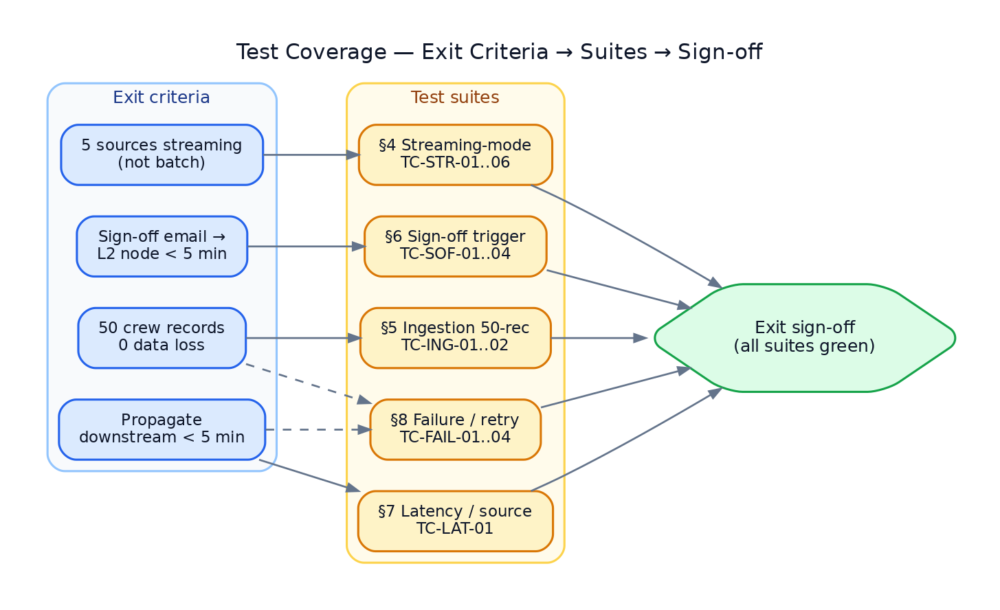

# L1 SignalFabric — Test Document

**Layer:** L1 SignalFabric
**Engineers:** Sreekumar M K, Sruthy
**Status:** Prototype test plan (for async review, due Jun 12, 2026)
**Companion:** see `DESIGN.md` (architecture, schema) and `PLAN.md` (daily demos)

---

## 1. Test Strategy

Testing maps **directly** to the four exit criteria. Every criterion has at least one
automated test plus a live demo path. Tests run from a cold `docker-compose up` so a fresh
checkout reproduces results.

| Exit criterion | Test suite (§) | Verdict gate |
|---|---|---|
| All 5 sources streaming (not batch) | §4 Streaming-mode | each source emits ≥1 `DELTA` via push/CDC, 0 via batch |
| Sign-off email → L2 SignOffEvent < 5 min | §6 Sign-off trigger | node created, latency < 300 s |
| 50 crew records, 0 data loss | §5 Ingestion (50-record) | sink count == source count, exactly |
| Changes propagate downstream < 5 min | §7 Latency per source | p95 latency < 300 s (target « 1 s push) |
| (resilience, supports the above) | §8 Failure/retry | 0 loss, ≤ documented duplicates, DLQ correct |

### 1.1 Levels & tooling

- **Unit** — `pytest` for normalizers, verifiers, classifiers, checkpoint math.
- **Integration** — connector → bus → sink with Redis + Postgres (compose), Pub/Sub emulator.
- **E2E / demo** — `make demo-dayN`; live sources where available, replay/emulator otherwise.
- **Load** — `scripts/seed_erp.py` + a driver that mutates N rows and reconciles counts.

### 1.2 Environments

| Env | Sources | Use |
|---|---|---|
| `local-mock` | injected fixtures / replay | unit + CI, deterministic |
| `local-live` | test Slack workspace, test Workspace Gmail, local Postgres | integration + demo |
| `emulator` | Pub/Sub emulator, recorded payloads | Gmail path without GCP tenant |

### 1.3 Fixtures

`tests/fixtures/` holds recorded, `event_id`-stamped real payloads:
`slack_message.json`, `slack_reaction.json`, `slack_join.json`, `gmail_push.json`,
`gmail_signoff.json`, `erp_outbox_batch.json`. `replay.py` injects them on the real code path.

---

## 2. Traceability Matrix

| ID | Title | Criterion | Level | Day |
|---|---|---|---|---|
| TC-STR-01 | Slack message streams as DELTA | streaming | int | 2 |
| TC-STR-02 | Slack reaction & channel-join stream | streaming | int | 2 |
| TC-STR-03 | Gmail metadata streams (no body) | streaming | int | 3 |
| TC-STR-04 | ERP crew change streams as DELTA | streaming | int | 4 |
| TC-STR-05 | ERP contract + vessel/port stream | streaming | int | 4 |
| TC-STR-06 | All 5 sources stream concurrently | streaming | e2e | 5 |
| TC-ING-01 | 50 crew records, 0 loss (clean) | 50-rec/0-loss | load | 4 |
| TC-ING-02 | 50 crew records, 0 loss (mid-run kill) | 50-rec/0-loss | load | 4 |
| TC-SOF-01 | Sign-off email → SignOffEvent node | sign-off | e2e | 3 |
| TC-SOF-02 | Sign-off latency < 5 min | sign-off | e2e | 3 |
| TC-SOF-03 | Sign-off idempotent (redelivery) | sign-off | int | 3 |
| TC-LAT-01 | Per-source p95 latency < 5 min | propagation | e2e | 4 |
| TC-FAIL-01 | Connector crash → resume, 0 loss | resilience | int | 4 |
| TC-FAIL-02 | Duplicate delivery → idempotent | resilience | int | 4 |
| TC-FAIL-03 | Poison message → DLQ | resilience | int | 4 |
| TC-FAIL-04 | Sink down → retry/backpressure, no drop | resilience | int | 4 |
| TC-SEC-01 | Bad Slack signature rejected | security | unit | 2 |
| TC-SEC-02 | Bad Pub/Sub JWT rejected | security | unit | 3 |
| TC-SEC-03 | Gmail body never fetched/stored | privacy | unit | 3 |

---

## 3. Common Verification Helpers

- **Latency:** `metadata.custom.sinkAt − extractedAt` per event; suite asserts p95 < 300 s.
- **Loss/dup:** compare source-side ids vs sink-side canonical `key`+`sourceSequence` sets;
  `missing = source − sink`, `dup = sink_count − distinct(sink)`.
- **Streaming proof:** assert `operation == "DELTA"` and arrival via push/poll (no manifest
  file consumed) — distinguishes from the upstream batch `SNAPSHOT` path.

---

## 4. Streaming-Mode Tests (criterion: all 5 sources streaming)

### TC-STR-01 — Slack message streams as DELTA
- **Pre:** service up; Slack connector live (or replay).
- **Steps:** post a message in the test channel (or inject `slack_message.json`).
- **Expect:** within seconds a `SignalEvent{sourceSystem:SLACK, entity:message, operation:DELTA}`
  reaches the sink; appears on `/stream`; OrgMap gains author↔channel edge.
- **Pass:** event present, `operation==DELTA`, no batch/manifest involved.

### TC-STR-02 — Slack reaction & channel-join
- **Steps:** add a reaction; join a channel.
- **Expect:** `entity:reaction` and `entity:channel_join` DELTAs; OrgMap edges created.

### TC-STR-03 — Gmail metadata streams (no body)
- **Steps:** send a test email (or push `gmail_push.json`).
- **Expect:** `sourceSystem:EMAIL, entity:email` DELTA with from/to/cc/thread/sent_at; **no
  `body`/`body_text`/`body_html` field present** (links to TC-SEC-03).

### TC-STR-04 / TC-STR-05 — ERP streams
- **Steps:** `UPDATE` a crew row; insert a contract; update a vessel/port row.
- **Expect:** one `DELTA` per change via outbox poller; correct `sourceSystem`
  (`CREW_DB`/`CONTRACT_CLM`/`VESSEL_PORT_DB`); watermark advances.

### TC-STR-06 — All 5 concurrent (Day-5 gate)
- **Steps:** drive Slack + Gmail + 3 ERP sources together for 2 min.
- **Expect:** all five appear on one dashboard; every event `DELTA`; 0 errors.

---

## 5. Ingestion Test — 50 Crew Records, 0 Data Loss (criterion)

### TC-ING-01 — Clean 50-record load
- **Setup:** `scripts/seed_erp.py --crew 50` seeds 50 distinct crew rows.
- **Steps:** trigger 50 updates (one per crew_id) → outbox → stream → sink.
- **Assert:**
  - sink received exactly **50** `crew` DELTAs;
  - `distinct(crew_id)` at sink == 50;
  - `missing == 0` and `dup == 0`;
  - final checkpoint == last outbox id.
- **Pass:** `source_count == sink_count == 50`, 0 missing, 0 dup.

### TC-ING-02 — 50-record with mid-run kill (overlaps §8)
- **Steps:** start the 50-update run; `kill -9` the ERP connector at ~record 25; restart.
- **Assert:** after resume, sink distinct count == 50, `missing == 0`. Duplicates allowed only
  if re-emitted before checkpoint commit **and** absorbed idempotently (net distinct == 50).
- **Pass:** **0 data loss**; net distinct == 50.

---

## 6. Sign-off Trigger Tests (criterion: email → L2 node < 5 min)

### TC-SOF-01 — Sign-off email creates SignOffEvent node
- **Steps:** send an email matching the sign-off rule (label `crew/sign-off` or subject
  pattern), or push `gmail_signoff.json`.
- **Expect:** Gmail connector classifies → `metadata.custom.l2Intent == CREATE_SIGNOFF_EVENT`;
  L2 sink upserts a **SignOffEvent** node keyed on `thread_id`+`crewRef`.
- **Pass:** exactly one SignOffEvent node exists with correct crew/vessel refs.

### TC-SOF-02 — Latency < 5 min
- **Measure:** `sinkAt − sent_at` (and `sinkAt − extractedAt`).
- **Pass:** **< 300 s** (expected sub-second to low-seconds via Pub/Sub push).

### TC-SOF-03 — Idempotent on redelivery
- **Steps:** redeliver the same Pub/Sub message (same `messageId`/`historyId`) 3×.
- **Pass:** still exactly **one** SignOffEvent node (no duplicates).

### TC-SOF-04 (negative) — non-sign-off email
- **Steps:** send an ordinary email.
- **Pass:** OrgMap edge created, **no** SignOffEvent node.

---

## 7. Latency Tests — Per Source (criterion: propagate < 5 min)

### TC-LAT-01
- **Method:** for each source, drive 30 events over 60 s; collect
  `sinkAt − extractedAt` per event.
- **Report:** min / p50 / p95 / max per source.

| Source | Target p95 | Expected |
|---|---|---|
| Slack | < 300 s | < 1 s |
| Gmail | < 300 s | 1–10 s (Pub/Sub + history.list) |
| ERP Crew DB | < 300 s | ≤ poll interval + ~1 s |
| ERP Contract CLM | < 300 s | ≤ poll interval + ~1 s |
| ERP Vessel/Port DB | < 300 s | ≤ poll interval + ~1 s |

- **Pass:** every source p95 **< 300 s**.

---

## 8. Failure / Retry Scenarios (resilience underpinning 0-loss & latency)

### TC-FAIL-01 — Connector crash → resume, 0 loss
- **Steps:** mid-stream `kill -9` a connector; restart.
- **Expect:** resumes from last committed `position()`; no gap, no silent drop.
- **Pass:** post-resume distinct count == expected; `missing == 0`.

### TC-FAIL-02 — Duplicate delivery → idempotent
- **Steps:** replay the same payload (Slack retry / Pub/Sub redelivery / outbox re-read) ≥3×.
- **Pass:** sink distinct unchanged; OrgMap/SignOffEvent not duplicated.

### TC-FAIL-03 — Poison message → DLQ
- **Steps:** inject a malformed payload that fails normalize/sink N times.
- **Expect:** after retry budget, message lands in `signal.dlq` with reason; stream is **not**
  blocked for healthy messages; alert/metric increments.
- **Pass:** message in DLQ, healthy throughput continues, replay tool re-injects after fix.

### TC-FAIL-04 — Sink/L2 down → retry & backpressure, no drop
- **Steps:** stop the L2 sink for 60 s while events flow; restart.
- **Expect:** events buffered in Redis Streams (pending), retried on recovery; **0 dropped**;
  latency rises but recovers; (if any event would exceed SLO, it is flagged in the report).
- **Pass:** `missing == 0` after recovery.

### TC-SEC-01/02/03 — Security & privacy
- **SEC-01:** tampered/expired `X-Slack-Signature` → `401`, event not processed.
- **SEC-02:** invalid/expired Pub/Sub OIDC JWT → `401`, event not processed.
- **SEC-03:** assert the Gmail fetch uses `format=metadata`; emitted `SignalEvent.data` has
  **no** `body*` keys; recorded HTTP calls never request full format. *(Privacy gate.)*

---

## 9. Daily Demo Acceptance (each must run green cold)

| Day | `make` target | Acceptance |
|---|---|---|
| Jun 08 | `demo-day1` | mock Slack + email events traverse ingress→bus→sink→`/stream`; `/healthz` green |
| Jun 09 | `demo-day2` | real (or replayed) Slack message/reaction/join in OrgMap; forced sink error → retry shown; TC-SEC-01 passes |
| Jun 10 | `demo-day3` | Gmail metadata edge + **sign-off → SignOffEvent < 5 min**; TC-SOF-01/02/03, TC-SEC-03 pass |
| Jun 11 | `demo-day4` | ERP crew update streams; kill+resume 0-loss; **50-record** reconciles; latency dashboard; TC-FAIL-01..04 pass |
| Jun 12 | `demo-day5` | all 5 sources concurrent; **full suite §4–§8 green** |

---

## 10. Exit Criteria Sign-off (final)

- [ ] **All 5 sources streaming (not batch)** — TC-STR-01..06 pass.
- [ ] **Sign-off email → L2 node < 5 min** — TC-SOF-01/02/03 pass.
- [ ] **50 crew records, 0 data loss** — TC-ING-01/02 pass.
- [ ] **Changes propagate downstream < 5 min** — TC-LAT-01 (all p95 < 300 s) + TC-FAIL-01..04 pass.

---

## 11. Test Deliverables

- `tests/` — unit + integration suites (pytest), runnable via `make test`.
- `tests/fixtures/` — recorded real payloads for deterministic replay.
- `scripts/seed_erp.py`, `scripts/replay.py`, `scripts/inject_mock.py`.
- CI job — runs `local-mock` + `emulator` suites on every push; load/latency reports archived.
- Results report — per-run latency percentiles, loss/dup reconciliation, DLQ contents.
</content>
