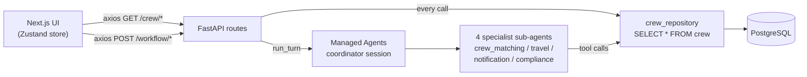
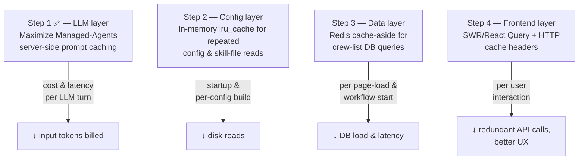
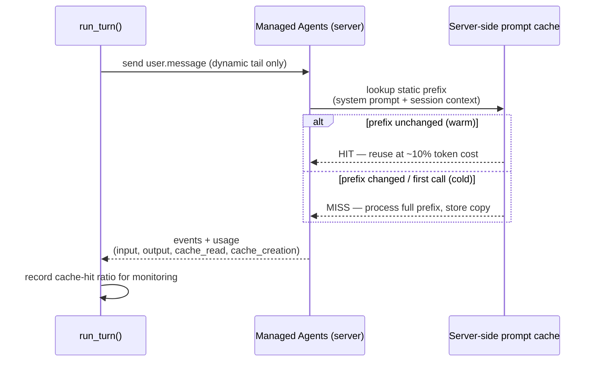
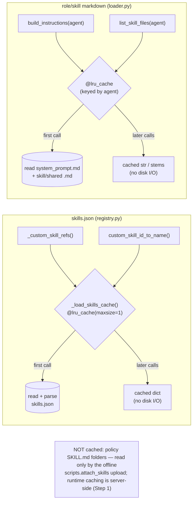
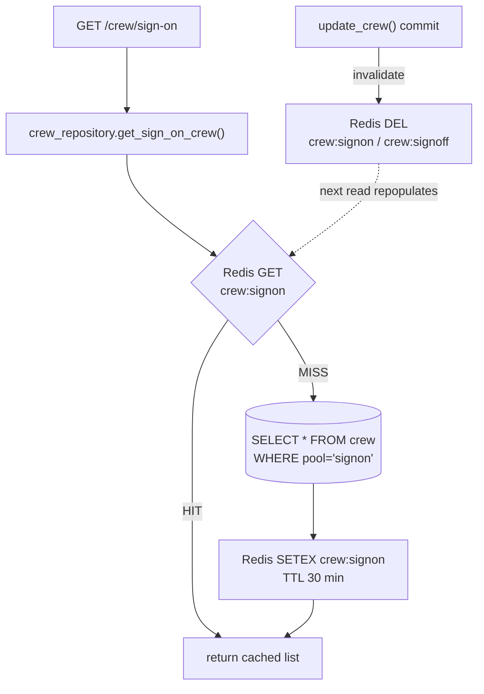
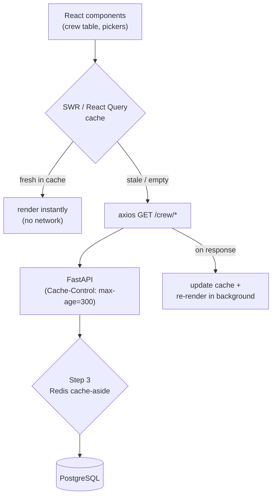
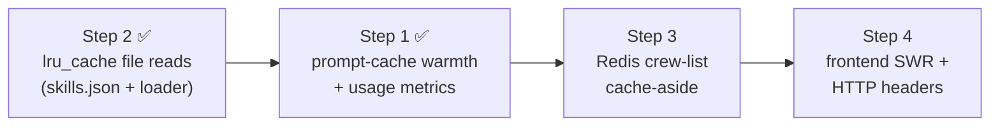

# Caching Design & Implementation Plan

**Project:** CrewManagement (Maritime Crew Orchestrator)
**Branch:** `Work_Cacheing`
**Status:** ✅ Implemented — Steps 1–4 are all wired up and live.
**Scope:** Steps 1–4. Step 5 (Redis-backed workflow-state persistence for multi-instance
deployment) is intentionally **deferred** and not covered here.

---

## 1. Context: what the system looks like today

| Layer | Stack | Caching today |
|-------|-------|---------------|
| Frontend | Next.js 15 + React 19 + Zustand, bare `axios` | None — crew lists fetched on every mount |
| Backend API | FastAPI (async) | None — no cache layer, no cache headers |
| LLM layer | Anthropic **Managed Agents** (`client.beta.sessions`) | Session reused across Phase 1→2 only |
| Database | PostgreSQL 16 (async SQLAlchemy + asyncpg) | None — full-table scans on every call |
| Infra | Docker Compose; **Redis 7 already declared but unused** | `redis_url` in config, never instantiated |

The two cheapest opportunities exist because Redis is *already provisioned* and `axios` is
*already centralized* in one file — so most of this plan is "use what's there", not "add new infra".

### End-to-end flow today (no caching)



Every box on the right is hit fresh on every request. The four steps below insert a cache in
front of the hot paths.

---

## 2. The four steps at a glance



| Step | Layer | Effort | Payoff | New dependency? |
|------|-------|--------|--------|-----------------|
| 1 ✅ | LLM (Managed Agents) | Low | High (token cost + latency) | No |
| 2 ✅ | Backend config + skill files | Trivial | Small–Medium (per-phase disk reads) | No (`functools` stdlib) |
| 3 ✅ | Backend data | Medium | Medium (DB load, ~50–100 ms) | `redis` async client (infra already there) |
| 4 ✅ | Frontend | Medium | Medium (UX, fewer calls) | SWR (npm) |

---

## Step 1 — Maximize Managed-Agents server-side prompt caching  ✅ Implemented

### What it does
Reduces the **input tokens billed on every coordinator/specialist turn**. The large, static
system prompts (the `COORDINATOR_SYSTEM_ROLE` and each specialist's `system_prompt()`) are
re-processed by the model on every turn. Prompt caching lets the platform reuse a stored copy
of that static prefix at ~10% of the normal input-token cost, and also lowers latency.

### How it does it — important nuance
This project does **not** call the raw Messages API, so there is no place to hand-insert
`cache_control` blocks per request. It uses **Managed Agents** (`client.beta.sessions` in
[backend/agents/managed/client.py](../backend/agents/managed/client.py)), where prompt caching
is **platform-managed**. Our job is therefore to *enable and keep the cache warm*, not to build it:

1. **Keep the persisted system prompts byte-stable.** The cache key is the prompt prefix. Every
   time `COORDINATOR_SYSTEM_ROLE` ([registry.py:48](../backend/agents/managed/registry.py#L48))
   or a specialist's `system_prompt()` changes — even whitespace — the server-side cache is
   invalidated and the next turn pays full price. Action: treat these prompts as stable artifacts;
   don't regenerate or reorder them at runtime.
2. **Put dynamic content at the *end* of each turn message.** In `_run_turn()`
   ([client.py:385](../backend/agents/managed/client.py#L385)) the per-turn `message` is sent as a
   `user.message`. The static instructions live in the persisted agent (cacheable prefix); the
   variable per-workflow data (crew id, reason, phase data) belongs at the tail so it doesn't
   disturb the cached prefix.
3. **Reuse the session across phases — already done.** A single coordinator session spans Phase 1
   (sign-off) and Phase 2 (sign-on); keeping it means the accumulated context stays cache-resident
   between the two human-separated turns. Preserve this; don't open a fresh session per phase.
4. **Verify the cache is actually hit — ✅ done.** `_run_turn()`
   ([client.py](../backend/agents/managed/client.py)) now also captures
   `cache_read_input_tokens` / `cache_creation_input_tokens` from each `span.model_request_end`
   event's `model_usage`. These accrue onto `WorkflowState` (`cache_read_tokens` /
   `cache_creation_tokens` in [models.py](../backend/database/models.py)) via `_record_usage`
   ([master_agent.py](../backend/agents/master_agent.py)), which also refines `total_cost` to bill
   cache reads at ~0.1× and writes at ~1.25× of the input rate. `get_metrics()`
   ([state_service.py](../backend/services/state_service.py)) aggregates them and computes
   `cache_hit_rate` = reads ÷ (reads + writes) × 100 over the cacheable prefix. The
   `/monitoring/metrics` endpoint returns `cache_read_tokens`, `cache_creation_tokens`,
   `cache_hit_rate`, and `/monitoring/workflows/active` exposes per-workflow cache tokens. The
   frontend surfaces a **Cache Hit Rate** KPI card on the monitoring dashboard
   ([monitoring/page.tsx](../frontend/src/app/monitoring/page.tsx)), backed by the new fields on the
   `SystemMetrics` type.

> Implemented with the **`claude-api`** skill, which confirmed the authoritative `model_usage`
> shape (`{input_tokens, output_tokens, cache_read_input_tokens, cache_creation_input_tokens}`) and
> that Managed Agents caches the prompt prefix automatically — there is no `cache_control` to insert.

### Flow



### Acceptance signal
*Met.* `/monitoring/metrics` now returns `cache_hit_rate` (with `cache_read_tokens` /
`cache_creation_tokens`), and the dashboard shows a **Cache Hit Rate** KPI. As the byte-stable
prompts persist, `cache_read_tokens` climbs and the ratio rises across repeated workflows while
billed input tokens per workflow drop. Metric math verified (reads ÷ (reads + writes), zero-safe).

---

## Step 2 — In-memory `lru_cache` for repeated config & skill-file reads  ✅ Implemented

### What it does
Eliminates repeated disk reads of the **two file sources that are re-read on a request/runtime
hot path**:

1. **`backend/skills.json`** — re-opened and re-parsed every time a specialist config is built
   (`_custom_skill_refs` and `custom_skill_id_to_name` in
   [registry.py](../backend/agents/managed/registry.py)).
2. **The role/skill markdown under `backend/agents/skills/<agent>/`** — `build_instructions()`
   reads `system_prompt.md` plus every skill `*.md` and `shared/*.md` and concatenates them. It is
   called inside `CrewMatchingAgent.__init__` ([crew_matching_agent.py:75](../backend/agents/crew_matching_agent.py#L75)),
   and a specialist is constructed **fresh on every workflow phase**, so each phase previously
   re-read a handful of files. `list_skill_files()` similarly re-globs the folder for the
   monitoring API ([loader.py](../backend/agents/skills/loader.py)).

All of these files are effectively immutable at runtime (they change only when a developer edits
them, after which the server restarts), so reading each once per process is enough.

### What it deliberately does NOT cache
The **policy `SKILL.md` folders** (`crew-travel-policy`, `visa-and-transit-requirements`,
`port-clearance-procedures`, `repatriation-rules`) are read **only** by `_skill_files()` →
`upload_skill()` → the offline one-shot `scripts/attach_skills.py`. They are never read on a
request path — the **hosted Anthropic agent** loads them server-side at runtime. An `lru_cache`
only pays off across repeated calls in a long-lived process, so caching a one-shot upload reader
saves nothing and would even be counter-productive in a dev *edit → re-upload* loop. Their runtime
caching belongs to **Step 1** (platform-side prompt/skill caching), not local disk caching.

### How it does it
Wrap each repeated reader in an `functools.lru_cache`'d helper:

- `skills.json` → `_load_skills_cache()` with `@lru_cache(maxsize=1)`; both call sites read through
  it. The cached dict is treated as read-only.
- role/skill markdown → `build_instructions()` is decorated with `@lru_cache(maxsize=None)` (keyed
  by agent name); `list_skill_files()` is backed by a cached `_skill_file_stems()` that returns an
  immutable tuple, and the public function returns a fresh `list(...)` so callers may mutate freely.

`lru_cache` does **not** cache exceptions, so a missing file on an early call is simply retried on
the next one rather than wedging an empty result.



### Acceptance signal
`skills.json` and each agent's role/skill markdown are read from disk **exactly once per process**;
specialist construction and config builds no longer touch the filesystem for that content.
*Verified:* after repeated calls, `build_instructions.cache_info()` reports 1 miss + N hits, and
mutating a `list_skill_files()` result does not corrupt the cache.

---

## Step 3 — Redis cache-aside for crew-list queries

### What it does
Caches the results of `get_sign_on_crew()` and `get_sign_off_crew()`
([crew_repository.py:15–30](../backend/database/crew_repository.py#L15)). These run full-table
`SELECT`s and are called on **every frontend page load** and at **every workflow initiation**,
even though the crew pool changes infrequently. A short-TTL cache removes most of that DB load and
shaves request latency.

### How it does it — cache-aside pattern
A new `backend/services/cache_service.py` instantiates an async Redis client against the existing
`settings.redis_url` ([config.py:36](../backend/config.py#L36)). The repository functions become
cache-aware:

1. **Read:** build a key (e.g. `crew:signon` / `crew:signoff`). Try Redis first.
   - **Hit** → deserialize JSON and return; never touch Postgres.
   - **Miss** → run the existing SQLAlchemy query, store the result in Redis with a TTL
     (suggested 30 min), return it.
2. **Write/invalidation:** `update_crew()` ([crew_repository.py:45](../backend/database/crew_repository.py#L45))
   already mutates the pool/status. After a successful commit it must **delete** the affected keys
   (`crew:signon`, `crew:signoff`) so the next read repopulates fresh data. This keeps the cache
   correct rather than relying on TTL alone.
3. **Graceful degradation:** if Redis is unreachable, fall through to the DB query (cache is an
   optimization, never a hard dependency).

> `get_crew_by_id()` is a point lookup used during compliance; it can be left uncached initially,
> or cached per-id with the same invalidation hook. Start with the two list queries — that is where
> the repeated full scans are.

### Flow



### Acceptance signal
Repeated `/crew/*` calls within the TTL window issue **zero** SQL; a crew mutation immediately
invalidates the cache so stale lists never surface; Redis outage falls back to DB with no errors.

---

## Step 4 — Frontend data caching (SWR / React Query + HTTP headers)

### What it does
Stops the UI from re-fetching slow-changing crew lists redundantly and gives it
stale-while-revalidate behavior: instant render from cache, silent background refresh. Today the
crew lists are fetched with bare `axios` in [frontend/src/lib/api.ts](../frontend/src/lib/api.ts)
and parked in the Zustand store with no dedup, no revalidation, and total loss on refresh.

### How it does it
1. **Client cache library:** introduce **SWR** (or **TanStack Query**) for the read-only crew
   endpoints — `crewApi.getSignOnCrew()` / `getSignOffCrew()`
   ([api.ts:14–15](../frontend/src/lib/api.ts#L14)). The library provides request **dedup**
   (multiple components → one network call), **caching with revalidation**, and **background
   refresh**, replacing the manual mount-time fetch.
2. **What stays uncached:** `POST /workflow/*` mutations and the **WebSocket** live event stream are
   inherently dynamic — leave them as-is. SWR wraps only the GET reads.
3. **HTTP cache headers (complementary, backend side):** add a `Cache-Control` header
   (e.g. `public, max-age=300`) to the GET crew endpoints via FastAPI response/middleware so the
   browser/axios layer can also short-circuit. This pairs with Step 3: backend Redis cuts DB load,
   HTTP headers cut network round-trips.

### Flow



### Acceptance signal
Navigating between views does not re-issue crew fetches within the freshness window; multiple
components mounting at once trigger a single network request; data still refreshes on revalidation.

---

## 3. Recommended implementation order



Rationale: Step 2 is a safe warm-up. Step 1 adds the usage metrics that *prove* later wins. Step 3
must land before Step 4 so the frontend caches data that is itself already DB-cheap. Step 4 closes
the loop at the edge.

## 4. Cross-cutting concerns

- **Correctness over hit-rate.** Every cache here needs an invalidation story (Step 3's
  `update_crew` hook is the critical one). A stale crew list shown during a live sign-off is worse
  than a slow one.
- **Graceful degradation.** Redis (Step 3) and the prompt cache (Step 1) are optimizations — the
  app must work identically if they are cold or unavailable.
- **Observability.** Step 1's cache-hit metric and a simple Redis hit/miss counter (Step 3) should
  surface on the existing `/monitoring` endpoints so the wins are measurable, not assumed.
- **Out of scope (Step 5, deferred):** moving the in-memory `StateService._workflows` dict to Redis
  for horizontal scaling. Revisit only when running more than one backend instance.
```

