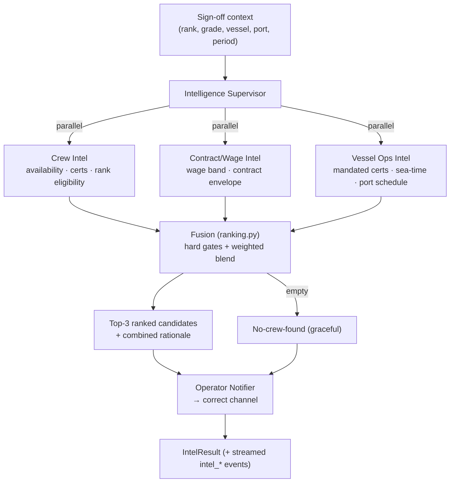

# L3 — Intelligence Graph (Design Doc)

**Layer:** L3 Intelligence Graph · **Engineers:** Satish, Venny ·
**Prototype:** Jun 11 · **Doc due:** Jun 12 (async review)

> Scope (from the build plan): *Supervisor + specialist investigators for the
> Maritime Crew domain. **Crew Intel** — availability, certs, rank eligibility.
> **Contract/Wage Intel** — applicable rules for the period. **Vessel Ops Intel** —
> requirements and port schedule. Supervisor orchestrates all three, triggers match
> + notify operators. Streaming via Vinu. Notifications via Venny.*

---

## 1. Purpose & position in the stack

L3 is the **reasoning layer**. It consumes the entities/relationships the **L2
Knowledge Graph** exposes (EntityMap / OpsMap / OrgMap) and turns a **sign-off
vacancy** into a **ranked, explained shortlist of replacement crew**, then notifies
the operators who act on it.

```
 L1 SignalFabric ─▶ L2 Knowledge Graph ─▶  L3 Intelligence Graph  ─▶ operators
 (event streams)    (EntityMap/OpsMap/      Supervisor + 3 investigators   (notify)
                     OrgMap in PG+AGE)       └─ ranked top-3 + rationale
                                                       ▲
                                            L4 Decision Graph feeds precedent back
```

**Prototype stance (important):** L3 ships in the repo's **"fallback" mode** — the
investigators are deterministic Python over rule data (`database/intel_rules.py`),
so L3 is demoable and testable **today** with no API key, no graph infra, and no
dependency on L2 being finished. The investigator interface is the seam: each can
later be backed by a Managed-Agents sub-agent issuing Cypher against L2's graph
without changing the Supervisor, the API, or the UI. This mirrors how
`database/compliance_graph.py` already de-risks AGE for the Compliance Agent.

---

## 2. Supervisor–investigator pattern

A **Supervisor** fans out to **three independent investigators**, each an expert in
one dimension, then **fuses** their verdicts. Investigators never see each other and
never rank across dimensions — that separation keeps each one independently testable
and swappable.



Code map (`backend/agents/intelligence/`):

| File | Responsibility |
| --- | --- |
| `supervisor.py` | `IntelligenceSupervisor` — load pool, run 3 investigators in parallel, fuse, notify, stream, time |
| `base_investigator.py` | `BaseInvestigator` — per-candidate `_assess` contract + timing/event wrapping |
| `crew_intel.py` / `contract_wage_intel.py` / `vessel_ops_intel.py` | the three investigators |
| `ranking.py` | `fuse()` — hard gates + weighted blend → top-N with rationale |
| `fit_graph.py` | `build_fit_graph()` — derive the run's node/edge graph (vacancy→candidates→dimensions→L2 facts) |
| `notifications.py` | `OperatorNotifier` — channel routing + delivery (Venny's slice) |
| `schemas.py` | dataclasses (`SignOffContext`, `Assessment`, `RankedCandidate`, `IntelResult`, …) |
| `database/intel_rules.py` | wage bands, contract envelope, vessel certs, port schedule (fallback rule data) |
| `api/routes/intelligence.py` | `POST /api/v1/intelligence/match` and `/match-context` |

---

## 3. Investigator specs (inputs / outputs)

All three implement `investigate(context, candidates) -> InvestigatorReport`, where
the report holds one **`Assessment`** per candidate:

```
Assessment{ investigator, crew_id, score: 0..1, eligible: bool (hard gate),
            signals: {...facts...}, reasons: [str] }
```

**Shared input — `SignOffContext`:** `vacated_rank`, `vacated_grade`, `vessel`,
`port`, `sign_off_date`, `contract_period_months` (default 6), `workflow_id`.

### 3.1 Crew Intel — availability · certs · rank eligibility
| | |
| --- | --- |
| **Reads** | candidate `status`/`availability`, `rank`, `stcw_status`, `certifications`, `experience_years` |
| **Hard gates** | unavailable → ineligible; rank wrong family or >1 step on the rank ladder → ineligible |
| **Score (0..1)** | exact rank +0.55 / adjacent +0.35; STCW valid +0.25 (expiring +0.10); base certs present +0.10; experience up to +0.10 |
| **Signals** | `available`, `rank_distance`, `stcw_status`, `missing_base_certs`, `experience_years` |

Rank ladders (`intel_rules.py`): deck `Deck Cadet→Third→Second→Chief Officer→Master`,
engine `Engine Cadet→Fourth→Third→Second→Chief Engineer`, ratings grouped. "Adjacent"
(distance 1) is acceptable cover; cross-family is not.

### 3.2 Contract/Wage Intel — applicable rules for the period
| | |
| --- | --- |
| **Reads** | candidate `grade` (→ modelled wage), vacancy `vacated_rank`, `contract_period_months` |
| **Hard gates** | none (advisory dimension — surfaces commercial fit, never blocks alone) |
| **Score (0..1)** | wage in band +0.6 (below band +0.5, over band scaled down); contract within standard envelope +0.4 (within MLC max +0.25) |
| **Signals / applied** | `expected_wage_usd`, `wage_band_usd`, `period_months`, `contract_rules` (MLC-aligned) |

Modelled wage = band midpoint × grade premium (`GRADE_MULTIPLIER`). Envelope =
`STANDARD_CONTRACT` (min 4 / max 9 / MLC max 11 months).

### 3.3 Vessel Ops Intel — requirements + port schedule
| | |
| --- | --- |
| **Reads** | candidate `certifications`, `experience_years`, `port`; vacancy `vacated_rank`, `port` |
| **Hard gates** | missing a **vessel-mandated cert** for the rank → ineligible |
| **Score (0..1)** | holds mandated certs +0.45; meets sea-time minimum +0.25; at join port +0.30 / can relocate in window +0.18 |
| **Signals / applied** | `required_certs`, `missing_required_certs`, `min_experience_years`, `join_port`, `join_by`, `departure_window_days` |

Port schedule (`PORT_DEPARTURE_DAYS`) gives the **join-by** date; relocation needs
`RELOCATION_LEAD_DAYS` of slack.

---

## 4. Fusion → top-3 with rationale

`ranking.fuse(reports, candidates_by_id, top_n=3)`:

1. **Hard gate:** if **any** investigator marks a candidate `eligible=False`, the
   candidate is **disqualified** (and the gate reason is captured for "why not").
2. **Blend:** `score = 0.50·crew + 0.30·vessel + 0.20·contract` (×100).
3. **Rationale:** the top reason from each surviving dimension, concatenated — so an
   operator sees *why* a candidate placed where they did.
4. **Order:** score desc, `crew_id` asc as a stable tiebreak → assign `rank_position`,
   take top-N. **Deterministic** (no randomness) so scenarios have stable expected output.

> Worked example (verified): CO vacancy at Singapore, 6-candidate pool → 4 disqualified
> by gates (missing GMDSS, unavailable, wrong family), shortlist =
> `#1 Juan dela Cruz 98.0`, `#2 Rajesh Kumar 83.4` (adjacent-rank Second Officer).

---

## 5. Operator flows & notifications (Venny's slice)

After fusion the **Operator Notifier** (`notifications.py`) dispatches to each
recipient on their **correct channel** (`CHANNEL_BY_ROLE`):

| Recipient role | Channel | When |
| --- | --- | --- |
| Crewing Manager | email | always (shortlist, or no-crew escalation) |
| Vessel Master | email | on match (proposed candidate) |
| Crew (proposed) | **sms** | on match (confirm availability) — satisfies "crew notified via correct channel" |
| Ops Center | slack | on no-crew (manual-action alert) |

Delivery uses a mock sink (returns a delivery record) so L3 is testable without
SMTP/Slack; the **channel-selection logic is the real, asserted behaviour**. The seam
matches the existing `NotificationAgent`, so production swaps `_deliver` for the real
mailer/Slack client without touching routing.

**No-crew-found flow:** when the shortlist is empty the Supervisor sets
`status="no_crew_found"`, emits `intel_no_crew`, and the Notifier escalates to Crewing
Manager + Ops Center instead of proposing anyone — a graceful, audited dead-end.

---

## 6. Streaming architecture

The Supervisor emits events through the **same callback → WebSocket vocabulary** the
rest of the app uses, so Vinu's streaming layer / the existing console render L3 with
no change. Event sequence per run:

```
intel_supervisor_started
  intel_investigator_started   × 3   (Crew / Contract-Wage / Vessel-Ops, in parallel)
  intel_investigator_completed × 3
intel_ranking            (top-N + rationale)         ─┐ one or the other
intel_no_crew            (graceful dead-end)          ─┘
intel_graph              (derived node/edge fit graph — animates in live)
intel_notification_sent  × N
intel_supervisor_completed   (status, timing)
```

**Derived fit graph (`intel_graph`):** after fusion the Supervisor turns the run into
a real node/edge graph — `(Vacancy)→(Candidate)→(Dimension)→(L2 Fact)`, with
disqualified candidates linking to the blocking dimension and the gate reason as the
edge label. It is a pure transform of data already computed (no new infra) and is
streamed as `intel_graph` + returned on `IntelResult.fit_graph`; the UI renders it
with React-Flow and staggers node entrance so the graph "draws itself" as the run
lands. This is the shape L4's Decision Graph can later persist as precedent.

**Latency design for the <2s first-token / <10s full SLOs:** the first event fires
*before* any blocking work, and the deterministic Python path completes in
single-digit milliseconds (measured `first_event_ms` and `total_ms` are returned in
`IntelResult.timing`). When investigators are later backed by LLM sub-agents, the
streaming-first ordering preserves the first-token budget while heavier reasoning
runs behind it.

---

## 7. API

```
POST /api/v1/intelligence/match
  { "crew_id": "<sign-off crew>", "contract_period_months": 6, "top_n": 3 }
  → IntelResult { status, candidates[], reports[], notifications[], timing, ... }

POST /api/v1/intelligence/match-context     # explicit vacancy, no crew lookup
  { "vacated_rank": "Chief Officer", "port": "Singapore", "top_n": 3 }
```

Events stream live on the global WebSocket (`/ws`).

---

## 8. Dependencies, risks, and the productionisation seam

- **Depends on L2** for the real graph (Contract + Certification nodes, vessel/port
  schedule). **Mitigation:** prototype runs on `intel_rules.py` fallback data; the
  investigator interface is unchanged when L2 lands.
- **Depends on L1** for fresh data; not needed for the prototype (seeded pool).
- **Feeds L4** — the `IntelResult` (ranked candidates + rationale + per-dimension
  scores) is exactly the trace L4's Decision Graph records; L4's Precedent Index will
  later feed back as an additional fusion signal.
- **In-scope owners:** Vinu = streaming, **Venny = notifications**, Satish = the rest.

**Open decisions for review:** fusion weights (currently 50/30/20); whether
Contract/Wage should ever hard-gate (e.g. wage > X% over band); rank-adjacency policy
for senior ranks (should CO auto-cover Master?).

---

## 9. Status

Prototype implemented and verified — see **[`L3_TEST_PLAN.md`](./L3_TEST_PLAN.md)**
and `backend/scripts/verify_l3_intelligence.py` (21/21 checks pass, all exit criteria
exercised).
